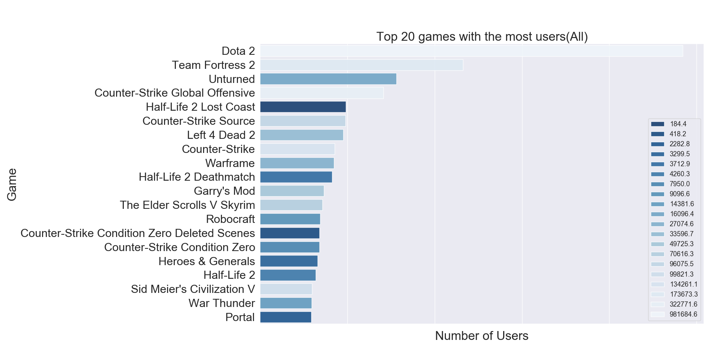
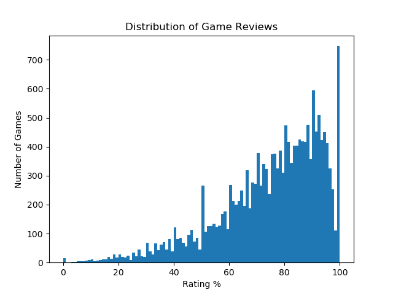
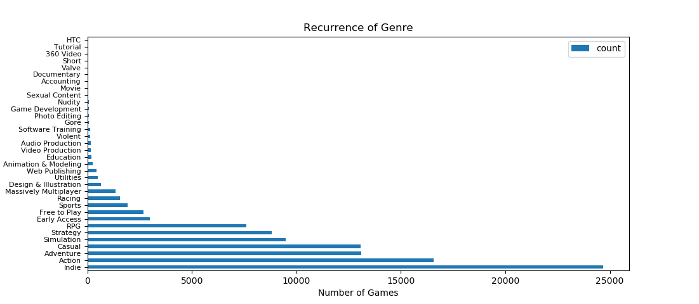
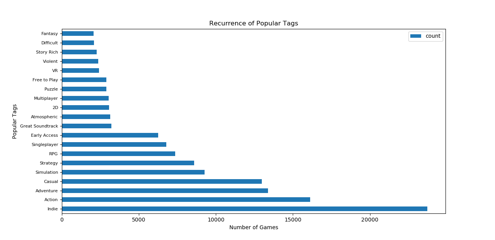
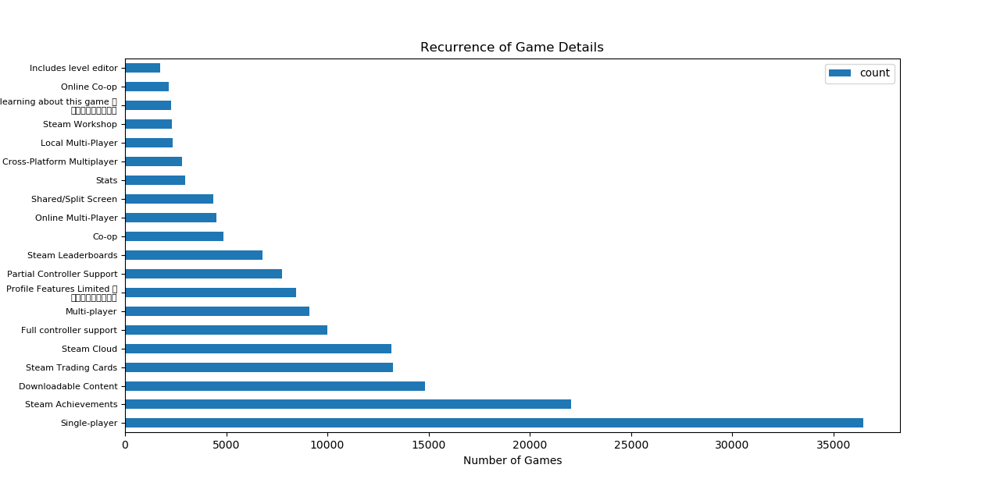
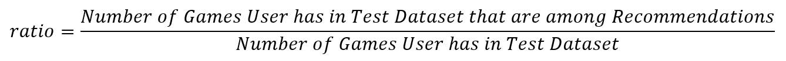

<link rel="stylesheet" href="style.css">

# Recommendation System for Steam Game Store: An overview of recommender systems

## Team:
- Doo Hyodan,
  Department Of Information System, Hanyang University, ammissyouyou@gmail.com<br/>
- Audrey Germain,
  Computer Engineering, Department of Software Engineering and Computer Engineering, Polytechnique Montreal<br/>
- Geordan Jove,
  Aerospace Engineering, Department of Mechanical Engineering, Polytechnique Montreal<br/>

## Table of content

[I. Introduction](#introduction)<br/>
[II. Datasets](#dataset)<br/>
&nbsp;&nbsp;[a. User Dataset](#user)<br/>
&nbsp;&nbsp;[b. Game Dataset](#game)<br/>
[III. Methodology](#methodology)<br/>
&nbsp;&nbsp;[Collaborative Recommender](#collaborative)<br/>
&nbsp;&nbsp;&nbsp;&nbsp;[a. Training and Test Datasets](#training-test)<br/>
&nbsp;&nbsp;&nbsp;&nbsp;[b. Collaborative Recommender with ALS](#als)<br/>
&nbsp;&nbsp;&nbsp;&nbsp;[c. Collaborative recommender with EM and SVD](#em)<br/>
&nbsp;&nbsp;[Content-based Recommender](#content-based)<br/>
[IV. Evaluation & Analysis](#evaluation-analysis)<br/>
[V. Related Work](#related-work)<br/>
[VI. Conclusion: Discussion](#conclusion)<br/>

## I. Introduction <a name="introduction"></a>
Like many young people, all member of this team have an interest in video games, more particularly in computer games. Therefore, the project developed throughout this blog has for goal to build a recommender system for computer games.

Recommender systems are widely used these days to recommend items users may potentially like. There are three main types of recommender system: collaborative filtering, content-based filtering and hybrid recommender system. 

The collaborative filtering is based on the principle that if two people liked the same things in the past, 
if one of them likes something new, the others are likely to like it too. The advantage of the collaborative filtering method is that the algorithm doesn’t need to understand or process the content 
of the items it recommends. The content-based filtering uses the description of the items in order to recommend items similar to what a user likes. The hybrid recommender system consists on combining the content-based and the collaborative filtering, either by using an algorithm that uses both or by combining the recommendations produced by both methods which, according to research, results in better recommendations than those obtained by using only one of them.
The collaborative filtering is based on the principle that if two people liked the same things in the past, 

The data used to implement a recommender system can be explicit, such as reviews or ratings, 
or implicit, such as behavior and events like order history, search logs, clicks, etc. The implicit data is harder to process because it’s hard to determine which information is useful and useless, but it’s easier to acquire compared to explicit data since the user doesn’t need to do anything more than using the website or app as usual.

The primary focus of this project is to build a recommender system used to recommend games to users based on their preferences and their gaming habits. In order to implement the best recommender system we possible can, multiple algorithms and approaches are developed in order to compare the recommendations produced by each one of them, allowing us to assess which algorithm produces more relevant recommendations for each user. Two collaborative filtering and one content-based algorithms are implemented.

For this project we are using data from Steam, one of the biggest video game digital distribution service for computer games. We will be using two datasets, having user and game data. These are explained in detail further in this blog.

This project is implemented as our final project for the course "Introduction to Artificial Intelligence" (ITE3051) at Hanyang University during for the Fall 2019 semester.

## II. Datasets <a name="dataset"></a>
For this project, two different datasets are used. Both are available for free on [Kaggle](https://www.kaggle.com/) and have data extracted from Steam.

### a. User Dataset <a name="user"></a>

The first dataset is the [user](https://www.kaggle.com/tamber/steam-video-games) dataset. It contains the user id, the game title, the behavior ('purchase' or 'play') and a value associated to the behavior. Each row of the dataset represent the behavior of a user towards a game, either 'play' or 'purchase'. If the behavior is 'play', the value associated to it corresponds to the amount of hours played. If the behavior is 'purchase', the value associated to it is 1, meaning the user purchased the game. In the case of this user dataset, the value associated to 'purchase' is always 1.

A portion of the user dataset is displayed in the table below. It is to note that the original dataset doesn't have headers, and those shown in the table are added for convenience based on the data description.

|  user_id  |         game_title         | behavior | value |
| :-------: | :------------------------: | :------: | :---: |
| 151603712 | The Elder Scrolls V Skyrim | purchase |   1   |
| 151603712 | The Elder Scrolls V Skyrim |   play   |  273  |
| 151603712 |         Fallout 4          | purchase |   1   |
| 151603712 |         Fallout 4          |   play   |  87   |
| 151603712 |           Spore            | purchase |   1   |
| 151603712 |           Spore            |   play   | 14.9  |
| 151603712 |     Fallout New Vegas      | purchase |   1   |
| 151603712 |     Fallout New Vegas      |   play   | 12.1  |
| 151603712 |       Left 4 Dead 2        | purchase |   1   |
| 151603712 |       Left 4 Dead 2        |   play   |  8.9  |

The user dataset contains a total of 200,000 rows, including 5,155 unique games and 12,393 unique users. For convenience, we reformatted the user dataset structure by slitting the information stored in the column 'behavior' into two columns: 'purchase' and 'play'. For each row, column 'play' has value 1 if the user actually played the game or 0 if the user has no record of hours played.

Each row in the reformatted user dataset represents then a unique interaction user/game. The reformatted user dataset is displayed in the table below. 

|  user_id  |         game_name          | hours | purchase | play |
| :-------: | :------------------------: | :---: | :------: | :--: |
| 151603712 | The Elder Scrolls V Skyrim |  273  |    1     |  1   |
| 151603712 |         Fallout 4          |  87   |    1     |  1   |
| 151603712 |           Spore            | 14.9  |    1     |  1   |
| 151603712 |     Fallout New Vegas      | 12.1  |    1     |  1   |
| 151603712 |       Left 4 Dead 2        |  8.9  |    1     |  1   |

With out reformatted user dataset, we start exploring and analyzing the user and game data stored within it. 

**Display something number purchased vs number play**

Then we try to asses if the most purchased games correspond to the most played games. For each game, we compute the total number of users and the total time the game was played by all users. The results are displayed in the table below in decreasing order based on the number of users, this for the top 20 games with most users. 

|                     game                     | user |   hrs    |
| :------------------------------------------: | :--: | :------: |
|                    Dota 2                    | 4841 | 981684.6 |
|               Team Fortress 2                | 2323 | 173673.3 |
|                   Unturned                   | 1563 | 16096.4  |
|       Counter-Strike Global Offensive        | 1412 | 322771.6 |
|            Half-Life 2 Lost Coast            | 981  |  184.4   |
|            Counter-Strike Source             | 978  | 96075.5  |
|                Left 4 Dead 2                 | 951  | 33596.7  |
|                Counter-Strike                | 856  | 134261.1 |
|                   Warframe                   | 847  | 27074.6  |
|            Half-Life 2 Deathmatch            | 823  |  3712.9  |
|                 Garry's Mod                  | 731  | 49725.3  |
|          The Elder Scrolls V Skyrim          | 716  | 70616.3  |
|                  Robocraft                   | 689  |  9096.6  |
| Counter-Strike Condition Zero Deleted Scenes | 679  |  418.2   |
|        Counter-Strike Condition Zero         | 679  |  7950.0  |
|              Heroes & Generals               | 658  |  3299.5  |
|                 Half-Life 2                  | 639  |  4260.3  |
|          Sid Meier's Civilization V          | 596  | 99821.3  |
|                 War Thunder                  | 590  | 14381.6  |
|                    Portal                    | 588  |  2282.8  |

We can see that for some games, there is a relation between most played and most purchased. For example, 'Dota 2' is undeniably the most popular game, it has the most number of users and the most total of hours played. However, this is not always the case, an interesting example is 'Half-Life 2 Lost Coast' which has high number of users (981 users), but the total of hours played is quite low (184.4 hours). A possible explanation for this could be that this game was purchased as part of a game bundle. 

We use a histogram plot in order to better visualize the results displayed in the table above. Game titles are ordered in decreasing order based on the number of users. The color gradient represents the total of hours played, from most played to least played.

 <a name="h_1"></a>

We can clearly see that for some cases there is no relation between the total number of users and the total of hours played, meaning that a high number of users does not represent an equivalent high total of hours played.

We recreate the same kind of plot, but this time considering only the users who actually played the games. Thus, for each game, we removed users who purchased it but never played it.
 <a name="h_2"></a>

When comparing this new plot against the previous one, we can see that some games fell down from the top 20 games based on the number of users. For example 'Counter-Strike Condition Zero', top 15 in the plot considering all users that purchased the game, does not appear in the top 20 of games considering only the users that actually played the game. An opposite example is that of 'Terraria' that appears in the second plot as top 11 while it's not listed in the first plot. As mentioned before, a possible explanations for this difference could  could be that several games were purchased as part of a game bundle. 

In order to have a better understanding of the user data distribution and user's playing habits, a box plot is produced for the top 20 most played game, based in the total of hours played.


As we can see, the data distribution for each game considered is not symmetrical. Even more, 75% of data points for each game is in the range of the hundreds hours, with several games having very large outliers. We can see for example a user played more than 10,000 hours "Dota 2". Another interesting example, a user played almost 12,000 hours "Sid Meier's Civilization V".

### b. Game Dataset <a name="game"></a>
The second dataset is the [game](https://www.kaggle.com/trolukovich/steam-games-complete-dataset/version/1) dataset. It contains a list of games, their descriptions, the url (directed to the Steam store), the type of package (app, bundle…), the game title, a short description, recent reviews, all reviews, release date, developer, publisher, popular tags (Gore, Action, Shooter, PvP…), game detail (Multi-player, Single-player, Full controller support…), languages, achievements, genre (Action, Adventure, RPG, Strategy…), game description, description of mature content, minimum requirement to run the game, recommended requirement, original price and price with discount. There is a total of 51920 games in the dataset.


To understand better how the game reviews are distributed, we plotted the amount of games with their 
respective percentage of positive reviews.



The plot below list all the game genres available in the game dataset with their respective number of games associated to each game genre.



We generated a similar plot, showing the top 20 most popular game tags available in the game dataset with their respective number of games associated to each game tag.



Lastly, the following plot shows the top 20 most recurrent game details available in the game dataset with their respective number of games associated to each game detail.




## III. Methodology <a name="methodology"></a>

We decided to use 3 different algorithms to generate recommendations for each given user. Two approaches using the collaborative filtering method (one using the ALS algorithm and another using the EM and SVD algorithms) and one approach using the content-based method.

All these approaches are to generate recommendations for the same users, allowing us to compare their outputs and evaluate which approach is better for our project.

### Collaborative Recommender <a name="collaborative"></a>

#### a. Training and Test Datasets <a name="training-test"></a>
Before implementing the algorithms to be used for the collaborative filtering recommender system, the training and testing dataset are created based on the source user dataset described in section [subsection II.a](#user). 

For this, we use the reformatted version having a total of 128804 rows, each one having unique information regarding the user/game interactions. We decided to extracted 20% of all user/game interactions (25761 rows) for the test dataset and kept the rest (103043 rows) for the training dataset.

The training dataset is meant to be used to implement the collaborative filtering recommender model. Once accomplished, the model is used to produce recommendations for all the users listed in the test dataset.

#### b. Collaborative Recommender with ALS <a name="als"></a>
This section describes a simple implementation of a collaborative filtering recommendation algorithm using matrix factorization with implicit data.
The work presented is based on the ["ALS Implicit Collaborative Filtering"](https://medium.com/radon-dev/als-implicit-collaborative-filtering-5ed653ba39fe "ALS Implicit Collaborative Filtering") and the ["A Gentle Introduction to Recommender Systems with Implicit Feedback"](https://jessesw.com/Rec-System/ "A Gentle Introduction to Recommender Systems with Implicit Feedback") blog posts.

Collaborative filtering does not require any information about the items or the users in order to provide recommendation. It only uses the interactions between users and items expressed by some kind of rating.

The data used for this recommender system is that of the steam users described in [subsection II.a](#user). The data does not explicitly contains the rating or preference of users towards the games, but rather it is **implicitly** expressed by the amount of hours users played games.

The Alternating Least Squares (ALS) is the model used to fit the data and generate recommendations. The ALS model is already implemented in the [implicit](https://github.com/benfred/implicit) python library thanks to [Ben Frederickson](http://www.benfrederickson.com/fast-implicit-matrix-factorization/).  
As described on its documentation [here](https://implicit.readthedocs.io/en/latest/als.html), the ALS algorithm available through the implicit library is a Recommendation Model based on the algorithms described in the paper [Collaborative Filtering for Implicit Feedback Datasets](http://yifanhu.net/PUB/cf.pdf) with performance optimizations described in [Applications of the Conjugate Gradient Method for Implicit Feedback Collaborative Filtering](http://citeseerx.ist.psu.edu/viewdoc/download?doi=10.1.1.379.6473&rep=rep1&type=pdf). The advantage of using the implicit python library versus a manual implementation of the algorithm is the speed required to generate recommendation since the ALS model in the implicit library uses Cython allowing the parallelization of the code among threads.

**(Explain what's ALS and what it does)**

In order to generate recommendations, the class ImplicitCollaborativeRecommender is implemented in a python script. The code is available here below.

<script src="https://gist.github.com/g30rdan/d992457bf34607493c19341c96761387.js"></script>
The collaborative recommender model is created using the training user dataset with the following lines of code.

<script src="https://gist.github.com/g30rdan/ae0a11c3715295c3fd88cb5ee6e7ee57.js"></script>
With me model successfully loaded, we can start generating recommendations for all the users for which user/items interactions were hidden during the process of 
training and testing data splitting. For each user, 20 recommendations are generated using the following lines of code. Recommendations are stored in a Pandas DataFrame, which is later on exported as a csv file.

<script src="https://gist.github.com/g30rdan/8f225e83ae3249fa051d8c4beba5e202.js"></script>
It is to note that for some users, the model fails to produce recommendations. This is  due to the fact that many users have only one user/interactions which ended up in the testing dataset. Hence, since the model has no knowledge about these users preferences, it cannot produce any recommendations. For these cases, the output values are set equal to '-999'.


#### c. Collaborative recommender with EM and SVD <a name="em"></a>

##### EM Algorithm <a name="c_1"></a>
*New:*

The Expectation-Maximization (EM) algorithm is an approach for maximum likelihood estimation in the presence of latent variables. It is an appropriate approach to use to estimate the parameters of a given data distribution.

In order to come up with a rating system (since the user dataset has implicit data), we decided to use the distributions of hours played for each game with the EM algorithm rather than using percentiles.

For our recommender system, games that were not played ('play' set to 0) are not considered. We create the rating system based on the distribution of hours played, this for each game available in the user dataset. We use 5 groups (equivalent to a 5 stars rating system) in order to define a rating users would give to a game they played based on the amount of hours each one played each game relative to that of everyone else.

To complete for: 

- Some Games like these add noise to the dataset.
- Such like hours of some free bad games could have a distribution under 2 hours. 

*Old:*

According to the Historgram [1](https://github.com/AudreyGermain/Game-Recommendation-System/blob/master/README.md#h_1) and [2](https://github.com/AudreyGermain/Game-Recommendation-System/blob/master/README.md#h_2), you can see Dota 2 has the highest number of players and the highest number of total hours played so undeniably the most popular game. Where as other games such as "Half-Life 2 Lost Coast" have 981 users but a total of 184.4 hours played. I expect this game is in most cases a free bundle game.

Some Games like these add noise to the dataset. So that's one of the reasons we use EM algorithms to create rating system for the games.

The Expectation-Maximization Algorithm is an approach for maximum likelihood estimation in the presence of latent variables. It is an appropriate approach to use to estimate the parameters of the distributions.

Because our recommendation system should take consideration the games hasn't been played. We could create a rating system for games based on distribution of playing hours. Such like hours of some free bad games could have a distribution under 2 hours. As following, We use the EM algorithm rather than percentiles to present the distribution. In the EM algorithm, We use 5 groups as 5 stars to distinguish the good from the bad.

**It would be good to explain what the code does in few lines. Add units to plot.**

```python
def game_hrs_density(GAME, nclass, print_vals=True):
    game_data = steam_clean[(steam_clean['game1'] == GAME) & (steam_clean['hrs'] > 2)]
    game_data['loghrs'] = np.log(steam_clean['hrs'])
    mu_init = np.linspace(min(game_data['loghrs']), max(game_data['loghrs']), nclass).reshape(-1, 1)
    sigma_init = np.array([1] * nclass).reshape(-1, 1, 1)
    gaussian = GaussianMixture(n_components=nclass, means_init=mu_init, precisions_init=sigma_init).fit(game_data['loghrs'].values.reshape([-1, 1]))
    if print_vals:
        print(' lambda: {}\n mean: {}\n sigma: {}\n'.format(gaussian.weights_, gaussian.means_, gaussian.covariances_))
    # building data frame for plotting
    x = np.linspace(min(game_data['loghrs']), max(game_data['loghrs']), 1000)
    dens = pd.DataFrame({'x': x})
    for i in range(nclass):
        dens['y{}'.format(i+1)] = gaussian.weights_[i]* scipy.stats.norm(gaussian.means_[i][0], gaussian.covariances_[i][0][0]).pdf(x)
    dens = dens.melt('x', value_name='gaussian')
    game_plt = ggplot(aes(x='loghrs', y='stat(density)'), game_data) + geom_histogram(bins=25, colour = "black", alpha = 0.7, size = 0.1) + \
               geom_area(dens, aes(x='x', y='gaussian', fill = 'variable'), alpha = 0.5, position = position_dodge(width=0.2)) + geom_density()+ \
               ggtitle(GAME)
    return game_plt
    
analy_game = game_hrs_density('TheWitcher3WildHunt', 5, True)
print(analy_game)
```


*New:*

As we can see in the plot above for 'The Witcher 3', the EM algorithm does a great job finding groups (5) of people with similar gaming habits and that would potentially rate a game in a similar way. We can see several users played 'The Witcher 3' game for very few hours. It's possible these users lost their interest into the game after playing some hours, possibly requesting a refund for it.

*Old:*

According to the plot, we could see the there are most of the users of The Witcher 3 distribute in group 5. However there are some users quickly lost their interests. It make sense to request a refund for the game that have been played less than 2 hours. As you can see EM algorithm does a great job finding the groups of people with similar gaming habits and would potentially rate the game in a similar way.  

##### Create User-Game Matrix <a name="c_2"></a>

*New:*

A user-item matrix is created with the users as rows and games as columns. The missing values are set to zero. The values stored in the matrix correspond to the `log(hours)` for each user-game combination. The data used to create the user-item matrix considers only games with more than 50 users and users that played a game for more than 2 hours. 

The following lines of code are used to create the user-item matrix.

*Old:*

A user-item matrix is created with the users being the rows and games being the columns. The missing values are set to zero. The observed values are the log hours for each observed user-game combination. The data was subset to games which have greater than 50 users and users which played the game for greater than 2 hours.

```python
np.random.seed(910)
game_freq['game1'] = game_freq['game'].apply(lambda x: re.sub('[^a-zA-Z0-9]', '', x))
game_users = game_freq[game_freq['user'] > 50]
steam_clean_pos = steam_clean[steam_clean['hrs'] > 2]
steam_clean_pos_idx = steam_clean_pos['game1'].apply(lambda x: x in game_users['game1'].values)
steam_clean_pos = steam_clean_pos[steam_clean_pos_idx]
steam_clean_pos['loghrs'] = np.log(steam_clean_pos['hrs'])

# make matrix
games = pd.DataFrame({'game1': sorted(steam_clean_pos['game1'].unique()), 'game_id': range(len(steam_clean_pos['game1'].unique()))})
users = pd.DataFrame({'user': sorted(steam_clean_pos['user'].unique()), 'user_id': range(len(steam_clean_pos['user'].unique()))})
steam_clean_pos = pd.merge(steam_clean_pos, games, on=['game1'])
steam_clean_pos = pd.merge(steam_clean_pos, users, on=['user'])
ui_mat = np.zeros([len(users), len(games)])
for i in range(steam_clean_pos.shape[0]):
    line = steam_clean_pos.iloc[i]
    ui_mat[line['user_id'], line['game_id']] = line['loghrs']

test=steam_train
ui_train = ui_mat
for i in range(test.shape[0]):
    line = test.iloc[i]
    ui_train[line['user_id'], line['game_id']] = 0

print("Dimensions of training user-item matrix:", ui_train.shape)
```
```python
Dimensions of training user-item matrix:（8206，492)
```

##### Basic SVD <a name="c_3"></a>
*New:*

We first use the basic SVD algorithm to factorize the user-item matrix into singular vectors and singular values, similar to what the eigendecomposition does . Since the missing values were set to zero, the factorization will try to recreate them, which is not something we want. We decided to simply replace the missing values with a mean value computed by using the observations considered.

*Old:*

At first we use the basic SVD to factorize a matrix, into singular vectors and singular values. The SVD allows us to discover some of the same kind of information as the eigendecomposition. Since the missing values are set to 0 the factorisation will try and recreate them which is not quite what we want. For this example we will simply impute the missing observations with a mean value.

```python
# root mean squared error function
def rmse(pred, test, data_frame=False):
    test_pred = np.array([np.nan] * len(test))
    for i in range(len(test)):
        line = test.iloc[i]
        test_pred[i] = pred[line['user_id'], line['game_id']]
    if data_frame:
        return pd.DataFrame({'test_pred': test_pred, 'loghrs': test['loghrs']})
    return np.sqrt(1/(len(test)-1)*np.sum((test_pred - test['loghrs']) ** 2))

# Basic svd
Y = pd.DataFrame(ui_train).copy()

# mean impute
means = np.mean(Y)
for i, col in enumerate(Y.columns):
    Y[col] = Y[col].apply(lambda x: means[i] if x == 0 else x)
U, D, V = np.linalg.svd(Y)

p_df = pd.DataFrame({'x': range(1, len(D)+1), 'y': D/np.sum(D)})
print(ggplot(p_df, aes(x='x', y='y')) + \
geom_line() + \
labs(x = "Leading component", y = ""))

lc = 60
pred = np.dot(np.dot(U[:, :lc], np.diag(D[:lc])), V[:lc, :])

print(rmse(pred, test))
rmse(pred, test, True).head()
```


**Missing plot**

As we see in the plot above, it seems like the basic SVD approach does not give the best prediction for us.

##### SVD via Gradient Descent <a name="c_4"></a>
*New:*

We decided to additionally consider a gradient descent approach in order to find optimal U and V matrices that can accurately represent the actual data stored in the user-item matrix.

We set the learning rate to *0.001* and the number of iteration to *200* while tracking the Root Mean Square Error (RMSE). The U and V matrices are initialized with a random values draw from a [0, 0.01] normal distribution. 

to complete for:

- Predict the missing values by drawing on the information between similar users and games.

*Old:*

Then we decide to use a gradient descent approach to find optimal U and V matrices which retain the actual observations with predict the missing values by drawing on the information between similar users and games. I have chosen a learning rate of 0.001 and will run for 200 iterations tracking the RMSE. The objective function is the squared error between the actual observed values and the predicted values. The U and V matrices are initialised with a random draw from a ~N(0, 0.01) distibution. This may take a few minutes to run.

```python
# SVD via gradient descent
# Setting matricies
leading_components=60

Y = pd.DataFrame(ui_train)
I = Y.copy()
for col in I.columns:
    I[col] = I[col].apply(lambda x: 1 if x > 0 else 0)
U = np.random.normal(0, 0.01, [I.shape[0], leading_components])
V = np.random.normal(0, 0.01, [I.shape[1], leading_components])

def f(U, V):
    return np.sum(I.values*(np.dot(U, V.T)-Y.values)**2)
def dfu(U):
    return np.dot((2*I.values*(np.dot(U, V.T)-Y.values)), V)
def dfv(V):
    return np.dot((2*I.values*(np.dot(U, V.T)-Y.values)).T, U)
    
# gradient descent
N = 200
alpha = 0.001
pred = np.round(np.dot(U, V.T), decimals=2)
fobj = [f(U, V)]
rmsej = [rmse(pred, test)]
start = time.time()
for i in tqdm(range(N)):
    U = U - alpha*dfu(U)
    V = V - alpha*dfv(V)
    fobj.append(f(U, V))
    pred = np.round(np.dot(U, V.T), 2)
    rmsej.append(rmse(pred, test))
print('Time difference of {} mins'.format((time.time() - start) / 60))
fojb = np.array(fobj)
rmsej = np.array(rmsej)
path1 = pd.DataFrame({'itr': range(1, N+2), 'fobj': fobj, 'fobjp': fobj/max(fobj), 'rmse': rmsej, 'rmsep': rmsej/max(rmsej)})
path1gg = pd.melt(path1[["itr", "fobjp", "rmsep"]], id_vars=['itr'])
print(path1.tail(1))
print(ggplot(path1gg, aes('itr', 'value', color = 'variable')) + geom_line())
```


**Improve plot: axis names and legend**

We can see there is a large improvement using the SVD with gradient descent over the basic SVD approach. The output shows the objective function converged to 0 on the training data, while the error in the test set essentially halved. Interestingly after the 75th iteration the accuracy in the test set decreased. This could be improved by using more leading components, the trade off being computation timej. Or perhaps stopping after 75 to 100 iterations for this data. After all it is the prediction of the unobserved which is the ultimate goal.

##### EM Compare <a name="c_5"></a>
After Using the predicted user-item matrix, let's look at the distribution of hours again for The Witcher 3 and apply an EM algoritm to find a reasonable 1-5 star rating

```python
def game_hrs_density_p(pred, GAME=None, nclass=1, print_vals=True):
    game_dict = dict(games.values)
    t_GAME = GAME
    if not GAME:
        GAME = np.random.randint(0, games.shape[0])
    else:
        GAME = game_dict[GAME]
    game_data = pd.Series(pred[:, GAME])
    game_data = game_data[game_data > 0]

    # em algorithm
    mu_init = np.linspace(min(game_data), max(game_data), nclass).reshape(-1, 1)
    sigma_init = np.array([1] * nclass).reshape(-1, 1, 1)
    gaussian = GaussianMixture(n_components=nclass, means_init=mu_init, precisions_init=sigma_init).fit(game_data.values.reshape([-1, 1]))
    if print_vals:
        print(' lambda: {}\n mean: {}\n sigma: {}\n'.format(gaussian.weights_, gaussian.means_, gaussian.covariances_))
    # building data frame for plotting
    x = np.linspace(min(game_data), max(game_data), 1000)
    dens = pd.DataFrame({'x': x})
    for i in range(nclass):
        dens['y{}'.format(i+1)] = gaussian.weights_[i]* scipy.stats.norm(gaussian.means_[i][0], gaussian.covariances_[i][0][0]).pdf(x)
    dens = dens.melt('x', value_name='gaussian')
    game_data = pd.DataFrame(game_data, columns=['game_daat'])
    game_plt = ggplot(aes(x='game_data', y='stat(density)'), game_data) + geom_histogram(bins=45, colour = "black", alpha = 0.7, size = 0.1) + \
               geom_area(dens, aes(x='x', y='gaussian', fill = 'variable'), alpha = 0.5, position = position_dodge(width=0.2)) + geom_density()+ \
               ggtitle(t_GAME)
    return game_plt

a = game_hrs_density_p(pred, "TheWitcher3WildHunt", 5)
print(a)
```


Perhaps not quite as appropriate this time as all the new predictions create a dense distribution. However the 2-4 distributions look like they fit fairly well. The 5 on the otherhand is rather flat and only picks up the very end of the tail.

##### Ouput <a name="c_6"></a>
At last we use a percentile approach to recommend the top 20 games for each user

```python
user_dict = dict(users.values)
game_dict = {games.iloc[i, 0]: games.iloc[i, 1] for i in range(games.shape[0])}
I_pred = np.zeros_like(I)
for i in range(steam_clean.shape[0]):
    line = steam_clean.iloc[i]
    if line['user'] in user_dict and line['game1'] in game_dict:
        I_pred[user_dict[line['user']], game_dict[line['game1']]] = 1

reverse_game_dict = {games.iloc[i, 1]: games.iloc[i, 0] for i in range(games.shape[0])}
pred_percentile = pd.DataFrame(pred)
for col in pred_percentile.columns:
    pred_percentile[col] = pred_percentile[col].rank(pct=True)
pred_percentile = pred_percentile.values
def top(n, user, print_value=True):
    not_purchased = (I - 1) % 2
    t_user = user
    user = user_dict[user]
    top_games = (pred_percentile*not_purchased).iloc[user]
    #     line = I_pred[user]
    #     for i, v in enumerate(line):
    #         if v == 1:
    #             top_games[i] = 0
    top_games = list(top_games.sort_values(ascending=False)[:20].index)
    if print_value:
        print('top {} recommended games for user {}: '.format(n, t_user))
        for i in range(n):
            print(i, ")", reverse_game_dict[top_games[i]])
    else:
        result = [t_user]
        for i in range(n):
            result.append(reverse_game_dict[top_games[i]])
        return result
#top(20, 5250)

top_N = 20
result = []
for idx, user in tqdm(enumerate(users['user'].values)):
      result.append(top(top_N, user, False))
      if idx > 8204:
         break
df = pd.DataFrame(result)
columns = ['user_id'] + ['{}'.format(i+1) for i in range(top_N)]
df.columns = columns
df.to_csv('D:/Game-Recommendation-System/data/output_data/Collaborative_EM_output.csv', index=None)
```
	top 20 recommended games for user 5250:
	0 ) DontStarve
	1 ) FTLFasterThanLight
	2 ) Warhammer40000DawnofWarIIRetribution
	3 ) SMITE
	4 ) FistfulofFrags
	5 ) KerbalSpaceProgram
	6 ) StarWarsRepublicCommando
	7 ) RIFT
	8 ) CompanyofHeroesTalesofValor
	9 ) CounterStrikeConditionZero
	10 ) PlanetSide2
	11 ) PrisonArchitect
	12 ) EmpireTotalWar
	13 ) DeadSpace
	14 ) Tropico4
	15 ) Warhammer40000DawnofWarII
	16 ) TombRaiderLegend
	17 ) Warhammer40000SpaceMarine
	18 ) TheWolfAmongUs
	19 ) AmnesiaTheDarkDescent


### Content-based Recommender <a name="content-based"></a>

The content-base recommender system gives recommendation based on the similarity between the game a user has and the other games.
In order to build the recommender system, we first need to prepare the data and the build the algorithm.
First, we need to preprocess the game dataset with all the useful information to give as 
an input to the recommender algorithm formated in an easier wait. We will also extract the percentage from the reviews
since we will need it. Then we will build the function used to give recommendation of games similar to another game and
we will finish by getting the recommendation for all user based on the games the user has.

To prepare the data for the content based recommender we started by selecting the information we thought would be the 
most useful to find similar games. We read the useful column using the following code.

```python
dataGames = read_csv(locationGamesFile, usecols=["name", "genre", "game_details", "popular_tags", "publisher", "developer"])
```

We decided to only keep the games that were both in the game dataset and the user dataset.
We chose to do it this way because there is a lot of games in the game dataset that have never been played or purchased by any user,
so there's no use in considering them in the recommender.
Also the dataset was too big to create the matrix of cosine similarity (this will be explain later)
since it took too much memory. To match the games from both dataset together, we created an ID for the games by removing
all symbols the weren't alphanumeric, removing all capital letters and removing all spaces using to following code. 
We did the same on the games in the user dataset.

```python
# remove spaces and special character from game name in both dataset
for i, row in dataGames.iterrows():
    clean = re.sub('[^A-Za-z0-9]+', '', row["name"])
    clean = clean.lower()
    dataGames.at[i, 'ID'] = clean
```

After this, we found all the uniques ID from the user dataset and kept only the rows in the games dataset where the ID 
matched one of the ID in the user dataset. This way we were able to get 3036 games of the game dataset that matched 
some of the 5152 games from the user dataset. Without the ID we only were able to find 71 games that matched only 
using the names. Since we have less games in the new game dataset, the recommender system will not be able to find 
recommendation for every games in the user dataset. This will surely affect its performance.<br/>

With the new smaller game dataset, we made sure to remove the spaces from the useful column we chose to use.
By removing the spaces, we ensure that, for exemple, Steam Achievement and Steam Cloud don't get a match because they 
both contain Steam. Therefore we apply the following function to all the columns like this.

```python
def clean_data(x):
    if isinstance(x, str):
        return x.replace(" ", "")
    else:
        print(x)
        return x


usedGames.loc[:, 'genre'] = usedGames['genre'].apply(clean_data)
```

Finally, we created some custom columns by combining multiple column to try and find the combination of information 
that will give us the best recommendation system possible. The results of the different columns will be compared in the 
[Evaluation & Analysis](#evaluation-analysis) section of this article.

```python
# create some column containing a mix of different information
usedGames["genre_publisher_developer"] = usedGames['genre'] + usedGames['publisher'] + usedGames['developer']
usedGames["genre_popular_tags_developer"] = usedGames['genre'] + usedGames['popular_tags'] + usedGames['developer']
usedGames["genre_popular_tags_game_details"] = usedGames['genre'] + usedGames['popular_tags'] + usedGames['game_details']
usedGames["genre_publisher_developer_game_details"] = usedGames['genre'] + usedGames['publisher'] + usedGames['developer'] + usedGames['game_details']
```

With all of those manipulations, the new game dataset that is going to be use by the algorithm looks like this.

| name                     | developer            | publisher                                   | popular_tags                                                 | game_details                                                 | genre                                                  | ID                 | genre_publisher_developer                                    | genre_popular_tags_developer                                 | genre_popular_tags_game_details                              | genre_publisher_developer_game_details                       |
| ------------------------ | -------------------- | ------------------------------------------- | ------------------------------------------------------------ | ------------------------------------------------------------ | ------------------------------------------------------ | ------------------ | ------------------------------------------------------------ | ------------------------------------------------------------ | ------------------------------------------------------------ | ------------------------------------------------------------ |
| DayZ                     | BohemiaInteractive   | "BohemiaInteractive,BohemiaInteractive"     | "Survival,Zombies,OpenWorld,Multiplayer,PvP,MassivelyMultiplayer,Action,EarlyAccess,Simulation,FPS,Post-apocalyptic,SurvivalHorror,Shooter,Sandbox,Adventure,Indie,Co-op,Atmospheric,Horror,Military" | "Multi-player,OnlineMulti-Player,SteamWorkshop,SteamCloud,ValveAnti-Cheatenabled" | "Action,Adventure,MassivelyMultiplayer"                | dayz               | "Action,Adventure,MassivelyMultiplayerBohemiaInteractive,BohemiaInteractiveBohemiaInteractive" | "Action,Adventure,MassivelyMultiplayerSurvival,Zombies,OpenWorld,Multiplayer,PvP,MassivelyMultiplayer,Action,EarlyAccess,Simulation,FPS,Post-apocalyptic,SurvivalHorror,Shooter,Sandbox,Adventure,Indie,Co-op,Atmospheric,Horror,MilitaryBohemiaInteractive" | "Action,Adventure,MassivelyMultiplayerSurvival,Zombies,OpenWorld,Multiplayer,PvP,MassivelyMultiplayer,Action,EarlyAccess,Simulation,FPS,Post-apocalyptic,SurvivalHorror,Shooter,Sandbox,Adventure,Indie,Co-op,Atmospheric,Horror,MilitaryMulti-player,OnlineMulti-Player,SteamWorkshop,SteamCloud,ValveAnti-Cheatenabled" | "Action,Adventure,MassivelyMultiplayerBohemiaInteractive,BohemiaInteractiveBohemiaInteractiveMulti-player,OnlineMulti-Player,SteamWorkshop,SteamCloud,ValveAnti-Cheatenabled" |
| EVE Online               | CCP                  | "CCP,CCP"                                   | "Space,MassivelyMultiplayer,Sci-fi,Sandbox,MMORPG,OpenWorld,RPG,PvP,Multiplayer,FreetoPlay,Economy,Strategy,SpaceSim,Simulation,Action,Difficult,Tactical,Capitalism,PvE,Atmospheric" | "Multi-player,OnlineMulti-Player,MMO,Co-op,OnlineCo-op,SteamTradingCards" | "Action,FreetoPlay,MassivelyMultiplayer,RPG,Strategy"  | eveonline          | "Action,FreetoPlay,MassivelyMultiplayer,RPG,StrategyCCP,CCPCCP" | "Action,FreetoPlay,MassivelyMultiplayer,RPG,StrategySpace,MassivelyMultiplayer,Sci-fi,Sandbox,MMORPG,OpenWorld,RPG,PvP,Multiplayer,FreetoPlay,Economy,Strategy,SpaceSim,Simulation,Action,Difficult,Tactical,Capitalism,PvE,AtmosphericCCP" | "Action,FreetoPlay,MassivelyMultiplayer,RPG,StrategySpace,MassivelyMultiplayer,Sci-fi,Sandbox,MMORPG,OpenWorld,RPG,PvP,Multiplayer,FreetoPlay,Economy,Strategy,SpaceSim,Simulation,Action,Difficult,Tactical,Capitalism,PvE,AtmosphericMulti-player,OnlineMulti-Player,MMO,Co-op,OnlineCo-op,SteamTradingCards" | "Action,FreetoPlay,MassivelyMultiplayer,RPG,StrategyCCP,CCPCCPMulti-player,OnlineMulti-Player,MMO,Co-op,OnlineCo-op,SteamTradingCards" |
| TERA                     | "Bluehole,Inc."      | "EnMasseEntertainment,EnMasseEntertainment" | "FreetoPlay,MMORPG,MassivelyMultiplayer,RPG,OpenWorld,Action,Fantasy,Adventure,Anime,ThirdPerson,CharacterCustomization,ActionRPG,Multiplayer,Co-op,PvP,HackandSlash,PvE,Cute,Controller,Nudity" | "Multi-player,MMO,Co-op,SteamTradingCards,PartialControllerSupport" | "Action,Adventure,FreetoPlay,MassivelyMultiplayer,RPG" | tera               | "Action,Adventure,FreetoPlay,MassivelyMultiplayer,RPGEnMasseEntertainment,EnMasseEntertainmentBluehole,Inc." | "Action,Adventure,FreetoPlay,MassivelyMultiplayer,RPGFreetoPlay,MMORPG,MassivelyMultiplayer,RPG,OpenWorld,Action,Fantasy,Adventure,Anime,ThirdPerson,CharacterCustomization,ActionRPG,Multiplayer,Co-op,PvP,HackandSlash,PvE,Cute,Controller,NudityBluehole,Inc." | "Action,Adventure,FreetoPlay,MassivelyMultiplayer,RPGFreetoPlay,MMORPG,MassivelyMultiplayer,RPG,OpenWorld,Action,Fantasy,Adventure,Anime,ThirdPerson,CharacterCustomization,ActionRPG,Multiplayer,Co-op,PvP,HackandSlash,PvE,Cute,Controller,NudityMulti-player,MMO,Co-op,SteamTradingCards,PartialControllerSupport" | "Action,Adventure,FreetoPlay,MassivelyMultiplayer,RPGEnMasseEntertainment,EnMasseEntertainmentBluehole,Inc.Multi-player,MMO,Co-op,SteamTradingCards,PartialControllerSupport" |
| Stonehearth              | RadiantEntertainment | "(none),(none)"                             | "CityBuilder,Building,Sandbox,Strategy,Survival,Simulation,Crafting,Voxel,EarlyAccess,Indie,Singleplayer,OpenWorld,RPG,Management,Multiplayer,Fantasy,Cute,Adventure,GodGame,RTS" | "Single-player,Multi-player,OnlineMulti-Player,LocalMulti-Player,Co-op,OnlineCo-op,LocalCo-op,SteamTradingCards,SteamWorkshop" | "Indie,Simulation,Strategy"                            | stonehearth        | "Indie,Simulation,Strategy(none),(none)RadiantEntertainment" | "Indie,Simulation,StrategyCityBuilder,Building,Sandbox,Strategy,Survival,Simulation,Crafting,Voxel,EarlyAccess,Indie,Singleplayer,OpenWorld,RPG,Management,Multiplayer,Fantasy,Cute,Adventure,GodGame,RTSRadiantEntertainment" | "Indie,Simulation,StrategyCityBuilder,Building,Sandbox,Strategy,Survival,Simulation,Crafting,Voxel,EarlyAccess,Indie,Singleplayer,OpenWorld,RPG,Management,Multiplayer,Fantasy,Cute,Adventure,GodGame,RTSSingle-player,Multi-player,OnlineMulti-Player,LocalMulti-Player,Co-op,OnlineCo-op,LocalCo-op,SteamTradingCards,SteamWorkshop" | "Indie,Simulation,Strategy(none),(none)RadiantEntertainmentSingle-player,Multi-player,OnlineMulti-Player,LocalMulti-Player,Co-op,OnlineCo-op,LocalCo-op,SteamTradingCards,SteamWorkshop" |
| Call of Duty®: Black Ops | Treyarch             | "Activision,Activision"                     | "Action,FPS,Zombies,Multiplayer,Shooter,Singleplayer,ColdWar,First-Person,War,Military,OnlineCo-Op,Co-op,Gore,StoryRich,Adventure,Controller,Linear,Masterpiece,Horror,MassivelyMultiplayer" | "Single-player,Multi-player,Co-op,SteamAchievements,PartialControllerSupport,ValveAnti-Cheatenabled" | Action                                                 | callofdutyblackops | "ActionActivision,ActivisionTreyarch"                        | "ActionAction,FPS,Zombies,Multiplayer,Shooter,Singleplayer,ColdWar,First-Person,War,Military,OnlineCo-Op,Co-op,Gore,StoryRich,Adventure,Controller,Linear,Masterpiece,Horror,MassivelyMultiplayerTreyarch" | "ActionAction,FPS,Zombies,Multiplayer,Shooter,Singleplayer,ColdWar,First-Person,War,Military,OnlineCo-Op,Co-op,Gore,StoryRich,Adventure,Controller,Linear,Masterpiece,Horror,MassivelyMultiplayerSingle-player,Multi-player,Co-op,SteamAchievements,PartialControllerSupport,ValveAnti-Cheatenabled" | "ActionActivision,ActivisionTreyarchSingle-player,Multi-player,Co-op,SteamAchievements,PartialControllerSupport,ValveAnti-Cheatenabled" |


To obtain the reviews, we had to do some manipulations on the review column in the game dataset to extract the 
percentage and other possibly useful information. We created the following script to do this and print the 
result in a CSV file. We read it from the content-based recommender script to get the reviews.

```python
for i, row in dataGames.iterrows():
    if type(row["all_reviews"]) == str:

        # extract % of positive reviews
        x = re.findall(r'- [0,1,2,3,4,5,6,7,8,9]*%', row["all_reviews"])
        if len(x) != 0:
            dataGames.at[i, 'percentage_positive_review'] = x[0].translate({ord(i): None for i in '- %'})

        # extract qualification of reviews
        reviewParse = row["all_reviews"].split(",")
        if 'user reviews' in reviewParse[0]:
            dataGames.at[i, 'review_qualification'] = ""
        else:
            dataGames.at[i, 'review_qualification'] = reviewParse[0]
```

We used the fact that all reviews follow this format:
"Mostly Positive,(11,481),- 74% of the 11,481 user reviews for this game are positive." 
to extract the information we wanted. 
We start by getting the percentage of good reviews by using regex to get the "- 74%" part of the reviews and we then keep the number only.
We also got the qualitative review by splitting the reviews at the comma and keeping the first one.
We ignore the qualification that contains the words 'user reviews' because it means not enough user reviewed the game
and the format is different. 

The review dataset created by this script looks like this:

name|percentage_positive_review|review_qualification|all_reviews
---|---|---|---|
DOOM|92|Very Positive|"Very Positive,(42,550),- 92% of the 42,550 user reviews for this game are positive."
PLAYERUNKNOWN'S BATTLEGROUNDS|49|Mixed|"Mixed,(836,608),- 49% of the 836,608 user reviews for this game are positive."
BATTLETECH|71|Mostly Positive|"Mostly Positive,(7,030),- 71% of the 7,030 user reviews for this game are positive."
DayZ|61|Mixed|"Mixed,(167,115),- 61% of the 167,115 user reviews for this game are positive."
EVE Online|74|Mostly Positive|"Mostly Positive,(11,481),- 74% of the 11,481 user reviews for this game are positive."


For the recommender system, we generate the cosine similarity matrix with the following code. First it calculate the matrix of frequency of each
words in the chosen column (column_name) of each of the games, then it calculate the cosine similarity function.<br/>

```python
# Compute the Cosine Similarity matrix using the column
count = CountVectorizer(stop_words='english')
count_matrix = count.fit_transform(dataGames[column_name])
cosine_sim_matrix = cosine_similarity(count_matrix, count_matrix)
```

The variable indices is a reverse map that use the name as key, it will be useful to get the index of each game in the cosine similarity matrix.<br/>

```python
# Construct a reverse map of indices and game names
indices = Series(dataGames.index, index=dataGames['name']).drop_duplicates()
```

To generate the recommendation for each game, the following function is used. The input of the function is the title of
the game as a string and the cosine matrix and the output is a list of recommended game title ordered by similarity.
The code for this function as well as the code to generate de cosine similarity matrix are taken from 
[this tutorial](https://www.datacamp.com/community/tutorials/recommender-systems-python?fbclid=IwAR1fz9YLOgZ95KHwoLpgb-hTdV2MekujDGBngRTG3kYmBJYxwSK3UWvNJDg).<br/>

```python
def get_recommendations(title, cosine_sim):

	if title not in listGames:
    	    return []

	# Get the index of the game that matches the name
	idx = indices[title]

	# if there's 2 games or more with same name (game RUSH)
	if type(idx) is Series:
    	    return []

	# Get the pairwise similarity scores of all games with that game
	sim_scores = list(enumerate(cosine_sim[idx]))

	# Sort the games based on the similarity scores
	sim_scores = sorted(sim_scores, key=lambda x: x[1], reverse=True)

	# Get the scores of the most similar games
	# (not the first one because this games as a score of 1 (perfect score) similarity with itself)
	sim_scores = sim_scores[1:n_recommendation + 1]

	# Get the games indices
	movie_indices = [i[0] for i in sim_scores]

	# Return the top most similar games
	return dataGames['name'].iloc[movie_indices].tolist()
```

The variable listGames is a list of all the games that are in both of the dataset (user and game dataset).
We make sure that the idx is not a Series, it can happen in the case where 2 different games have the same name (in our dataset 2 games have the name "RUSH").
Then we get the similarity score of each games from the matrix and we order it from the most similar to the less similar.
Finally we just need to extract the amount of recommendation that we want and return the list.
The variable n_recommendation contains the amount of recommendation we want to get, we decided to set it to 20.<br/>

To get the recommendation for each user, we implemented a function that combines the recommendations and get the
recommendation with the best reviews (extracted from the game dataset). This function takes the ID of each user,
the list of recommendation (the recommendation function explained previously is applied to all the games a user
has and a list of all the recommendations is made) and the list of all the game the user already has. The function
return a dataframe containing the user ID in the first column and then 20 column with the top recommendations.<br/>

```python
def make_recommendation_for_user(user_id, game_list, game_user_have):
	if type(game_list) is not list or len(game_list) == 0:
    	    # return empty one
    	    return DataFrame(data=[[user_id] + [""] * n_recommendation], columns=col_names)

	# get reviews of game recommendation, remove the games the user already has and order them by reviews
	recommendation_reviews = dataReviews.loc[dataReviews['name'].isin(game_list)]
	recommendation_reviews = recommendation_reviews.loc[~recommendation_reviews['name'].isin(game_user_have)]
	recommendation_reviews = recommendation_reviews.sort_values(by="percentage_positive_review", ascending=False)

	if len(recommendation_reviews.index) < n_recommendation:
    	    return DataFrame(data=[[user_id] + recommendation_reviews["name"].tolist() +
                           	   [""] * (n_recommendation - len(recommendation_reviews.index))],
                     	     columns=col_names)
	else:
    	    return DataFrame(data=[[user_id] + recommendation_reviews["name"].tolist()[0:n_recommendation]],
                     	     columns=col_names)
```
First, if the list of recommendation is empty (can happen if none of the game the user has are in the game dataset)
or not valid, a dataframe without recommendation is returned. If there is no problem with the recommendation list,
we get a dataframe of the name of the recommended games and the review (percentage of positive review) and we remove
the games that the user already has (no need to recommend a game the user already has). Then the recommendation are
ordered from the best review to the worst. If there is less recommendations then needed, empty spaces fill the rest of the column.
The reviews are used to order the recommendation since it's the easiest way to order them particularly considering that
not every games the user has produce recommendation because of the games in both datasets do not match totally like mentionned above.
If it wasn't because of that problem, we thought of taking into account the proportion of play time of each games to
recommend similar games to games that are most played. Using the reviews still ensure that the recommended games are
considered good in general by all the users.<br/>

All the dataframe rows produced by the function 'make_recommendation_for_user' are combine and are printed in a CSV file.<br/>

The whole script is arranged in a function to let us run it with multiple different input.
Those columns correspond to the variable column_name in the code that generate the cosine similarity matrix.<br/>

## IV. Evaluation & Analysis <a name="evaluation-analysis"></a>

To compare the different algorithms we created a script that calculate the ratio of games the user has 
(in the test dataset) that are in the top 20 recommendations and the amount of games the user has in the
test dataset. The mean of the ratio for all users is the calculated. The ratio is a bit low because for some
user in the training dataset it was not possible to get the recommendations and some user don't have games
in the test dataset, in those cases the ratio will be 0. <br>

The idea of calculating the ratio in this way was inspired but the precision at K metric used in the KDD reseach paper: 
[Real-time Attention Based Look-alike Model for Recommender System](https://www.kdd.org/kdd2019/accepted-papers/view/real-time-attention-based-look-alike-model-for-recommender-system).



First of all, we compared the content based algorithm with different input. 
Those input are either column from the original dataset or a combination of different columns. 
In the following table we ca see the ratio for the different inputs. 
As we can see, the best algorithm is the one that uses the genre, publisher and developer of the game as input.
This version will be used to compare the other 2 algorithms.

Content-Based Algorithm Input| Ratio [10<sup>2</sup>] | Number of Game in the Recommendation the User has in Test Dataset | Number of Game the User has in Test Dataset
------------ | ------------- | ------------- | -------------
Popular tags| 0.6455 | 0.074316 | 2.190587
Genre | 1.0847 | 0.069745 | 2.190587
Genre, popular tags & developer | 0.6992 | 0.075571 | 2.190587
Genre, popular tags & game details | 0.9144 | 0.093949 | 2.190587
Genre, publisher & developer | 1.8198 | 0.105782 | 2.190587
Genre, publisher, developer & game details | 1.6764 | 0.104169 | 2.190587

We calculated the ratio in the same way for both of the collaborative algorithm, the result are in the following table.
As we can see, the collaborative recommender with ALS is the best one.
The performance of the collaborative recommendation system with EM and SVD and the content-based recommender system are far behind it.

Algorithm| Ratio [10<sup>2</sup>] | Number of Game in the Recommendation the User has in Test Dataset | Number of Game the User has in Test Dataset
------------ | ------------- | ------------- | -------------
Collaborative with ALS| 9.3402 | 0.444216 | 4.414910
Collaborative with EM and SVD | 0.4143 | 0.024372 | 2.909578
Content-based (Genre, publisher & developer) | 1.8198 | 0.105782 | 2.190587

## V. Related Work <a name="related-work"></a>

To understand what a recommender system is and the different types, we used [this article](https://marutitech.com/recommendation-engine-benefits/).<br/>

To manipulate the datasets, we used the [pandas](https://pandas.pydata.org/) library.<br/>

For the content-based recommender system we used the some code from the blog post
[Recommender Systems in Python: Beginner Tutorial](https://www.datacamp.com/community/tutorials/recommender-systems-python?fbclid=IwAR1fz9YLOgZ95KHwoLpgb-hTdV2MekujDGBngRTG3kYmBJYxwSK3UWvNJDg)
to implement the function that give the recommendation for each games.<br/>

For the EM algorithm we used the article
[Machine Learning with Python: Exception Maximization and Gaussian Mixture Models in Python](https://www.python-course.eu/expectation_maximization_and_gaussian_mixture_models.php).<br/>

The KDD research paper [Real-time Attention Based Look-alike Model for Recommender System](https://www.kdd.org/kdd2019/accepted-papers/view/real-time-attention-based-look-alike-model-for-recommender-system)
gave us the idea to calculate the ratio the way we did to compare the algorithms.

## VI. Conclusion: Discussion <a name="conclusion"></a>

In conclusion, we implemented 3 different algorithm for recommendation system, one content-based and two collaborative,
one with the ALS algorithm and the other with the EM and SVD algorithm. The collaborative recommender with the ALS
algorithm seems to give the best recommendation based on our evaluation.<br/>

When the project was started using the 2 datasets, it was expected, since the both came from Steam, that every game in 
the user dataset would match a game in the training dataset, but as the project progressed we realized it wasn't the case. 
This caused a major issue for the content-based algorithm since it really relies on the fact that the game dataset 
have information about the games that are in the user dataset. Because of this issue, it was not possible to generate 
recommendation for every games the users have. Because of this, a lot of user don't have recommendation and it probably 
affect the performance of the algorithm. If we had to do a similar project on recommender system again, it would be 
important to make sure we have information about every product when choosing the datasets.<br/>

It would be interesting to create an hybrid recommender system using the collaborative recommender with the ALS 
algorithm and the content based algorithm using the genre, publisher and developer as input to see if we can make 
a recommender system even more effective then the 2 on their own.
