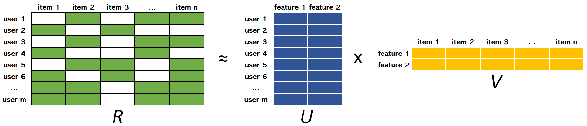

<link rel="stylesheet" href="style.css">

# Recommendation System for Steam Game Store: An overview of recommender systems
<p align="right">
  <a href="https://youtu.be/c7KidBmQb84">Short Youtube Version</a>
</p>
<p align="right">
  <a href="https://youtu.be/B6_cj70Gd3w">Complete Youtube Version</a>
</p>

## Team:
- Doo Hyodan,
  Department Of Information System, Hanyang University, ammissyouyou@gmail.com
  
- Audrey Germain,
  Computer Engineering, Department of Software Engineering and Computer Engineering, Polytechnique Montreal
  
- Geordan Jove,
  Aerospace Engineering, Department of Mechanical Engineering, Polytechnique Montreal

## Table of content

[I. Introduction](#introduction)<br/>
[II. Datasets](#dataset)<br/>
&nbsp;&nbsp;[a. User Dataset](#user)<br/>
&nbsp;&nbsp;[b. Game Dataset](#game)<br/>
[III. Methodology](#methodology)<br/>
&nbsp;&nbsp;[Collaborative Recommender](#collaborative)<br/>
&nbsp;&nbsp;&nbsp;&nbsp;[a. Training and Test Datasets](#training-test)<br/>
&nbsp;&nbsp;&nbsp;&nbsp;[b. Collaborative Recommender with ALS](#als)<br/>
&nbsp;&nbsp;&nbsp;&nbsp;[c. Collaborative recommender with EM and SVD](#em)<br/>
&nbsp;&nbsp;[Content-based Recommender](#content-based)<br/>
[IV. Evaluation & Analysis](#evaluation-analysis)<br/>
[V. Related Work](#related-work)<br/>
[VI. Conclusion: Discussion](#conclusion)<br/>

## I. Introduction <a name="introduction"></a>
Like many young people, all members of this team have an interest in video games, more particularly in computer games. Therefore, the goal of the project developed throughout this blog is to build a recommender system for computer games.

Recommender systems are widely used these days to recommend items users may potentially like. There are three main types of recommender system: collaborative filtering, content-based filtering and hybrid recommender system. 

The collaborative filtering is based on the principle that if two people liked the same things in the past, if one of them likes something new, the other is likely to like it too. The advantage of the collaborative filtering method is that the algorithm doesn’t need to understand or process the content of the items it recommends. The content-based filtering uses the description of the items in order to recommend items similar to what a user likes. The hybrid recommender system consists of combining the content-based and the collaborative filtering, either by using an algorithm that uses both or by combining the recommendations produced by both methods. According to research, it results in better recommendations than those obtained by using only one of them.

The data used to implement a recommender system can be explicit, such as reviews or ratings, or implicit, such as behavior and events like order history, search logs, clicks, etc. The implicit data is harder to process because it’s hard to determine which information is useful and useless, but it’s easier to acquire compared to explicit data since the user doesn’t need to do anything more than using the website or app as usual.

The primary focus of this project is to build a recommender system to recommend games to users based on their preferences and their gaming habits. In order to implement the best recommender system we possibly can, multiple algorithms and approaches are developed in order to compare the recommendations produced by each one of them, allowing us to assess which algorithm produces more relevant recommendations. Two collaborative filtering and one content-based algorithms are implemented.

For this project we are using data from Steam, one of the biggest video game digital distribution service for computer games. We will be using two datasets, having user and game data. These will be explain in detail further in this blog.

This project is implemented as our final project for the course "Introduction to Artificial Intelligence" (ITE3051) at Hanyang University during for the Fall 2019 semester.

## II. Datasets <a name="dataset"></a>
For this project, two different datasets are used. Both are available for free on [Kaggle](https://www.kaggle.com/) and have data extracted from Steam.

### a. User Dataset <a name="user"></a>

The first dataset is the [user](https://www.kaggle.com/tamber/steam-video-games) dataset. It contains the user id, the game title, the behavior ('purchase' or 'play') and a value associated to the behavior. Each row of the dataset represent the behavior of a user towards a game, either 'play' or 'purchase'. If the behavior is 'play', the value associated to it corresponds to the amount of hours played. If the behavior is 'purchase', the value associated to it is 1, meaning the user purchased the game. In the case of this user dataset, the value associated to 'purchase' is always 1.

A portion of the user dataset is displayed in the table below. It is to note that the original dataset doesn't have headers, and those shown in the table below are added for convenience based on the data description.

|  user_id  |         game_title         | behavior | value |
| :-------: | :------------------------: | :------: | :---: |
| 151603712 | The Elder Scrolls V Skyrim | purchase |   1   |
| 151603712 | The Elder Scrolls V Skyrim |   play   |  273  |
| 151603712 |         Fallout 4          | purchase |   1   |
| 151603712 |         Fallout 4          |   play   |  87   |
| 151603712 |           Spore            | purchase |   1   |
| 151603712 |           Spore            |   play   | 14.9  |
| 151603712 |     Fallout New Vegas      | purchase |   1   |
| 151603712 |     Fallout New Vegas      |   play   | 12.1  |
| 151603712 |       Left 4 Dead 2        | purchase |   1   |
| 151603712 |       Left 4 Dead 2        |   play   |  8.9  |

The user dataset contains a total of 200,000 rows, including 5,155 unique games and 12,393 unique users. For convenience, we reformatted the user dataset structure by slitting the information stored in the column 'behavior' into two columns: 'purchase' and 'play'. For each row, column 'play' has value 1 if the user actually played the game or 0 if the user has no record of hours played.

Each row in the reformatted user dataset represents then a unique interaction user-game. A portion of the reformatted user dataset is displayed in the table below. 

|  user_id  |         game_name          | hours | purchase | play |
| :-------: | :------------------------: | :---: | :------: | :--: |
| 151603712 | The Elder Scrolls V Skyrim |  273  |    1     |  1   |
| 151603712 |         Fallout 4          |  87   |    1     |  1   |
| 151603712 |           Spore            | 14.9  |    1     |  1   |
| 151603712 |     Fallout New Vegas      | 12.1  |    1     |  1   |
| 151603712 |       Left 4 Dead 2        |  8.9  |    1     |  1   |

Using our reformatted user dataset, we start exploring and analyzing the data stored within it. 

We try to assess if the most purchased games correspond to the most played games. For each game, we compute the total number of users and the total time of the game was played by all users. The results are displayed in the table below in decreasing order based on the number of users, this for the top 20 games with most users. 

|                     game                     | user |   hrs    |
| :------------------------------------------: | :--: | :------: |
|                    Dota 2                    | 4841 | 981684.6 |
|               Team Fortress 2                | 2323 | 173673.3 |
|                   Unturned                   | 1563 | 16096.4  |
|       Counter-Strike Global Offensive        | 1412 | 322771.6 |
|            Half-Life 2 Lost Coast            | 981  |  184.4   |
|            Counter-Strike Source             | 978  | 96075.5  |
|                Left 4 Dead 2                 | 951  | 33596.7  |
|                Counter-Strike                | 856  | 134261.1 |
|                   Warframe                   | 847  | 27074.6  |
|            Half-Life 2 Deathmatch            | 823  |  3712.9  |
|                 Garry's Mod                  | 731  | 49725.3  |
|          The Elder Scrolls V Skyrim          | 716  | 70616.3  |
|                  Robocraft                   | 689  |  9096.6  |
| Counter-Strike Condition Zero Deleted Scenes | 679  |  418.2   |
|        Counter-Strike Condition Zero         | 679  |  7950.0  |
|              Heroes & Generals               | 658  |  3299.5  |
|                 Half-Life 2                  | 639  |  4260.3  |
|          Sid Meier's Civilization V          | 596  | 99821.3  |
|                 War Thunder                  | 590  | 14381.6  |
|                    Portal                    | 588  |  2282.8  |

We can see that for some games, there is a relation between most played and most purchased. For example, 'Dota 2' is undeniably the most popular game, it has the most number of users and the most total of hours played. However, this is not always the case, an interesting example is 'Half-Life 2 Lost Coast' which has a high number of users (981 users), but the total of hours played is quite low (184.4 hours). A possible explanation for this could be that this game was purchased as part of a game bundle. 

We use a histogram plot in order to better visualize the results displayed in the table above. Game titles are ordered in decreasing order based on the number of users. The color gradient represents the total of hours played, from most played to least played.

 <a name="h_1"></a>

We can clearly see that for some cases there is no relation between the total number of users and the total of hours played, meaning that a high number of users does not represent an equivalent high total of hours played.

We recreate the same kind of plot, but this time considering only the users who actually played the games. Thus, for each game, we removed users who purchased it but never played it.
 <a name="h_2"></a>

When comparing this new plot against the previous one, we can see that some games fell down from the top 20 games based on the number of users. For example 'Counter-Strike Condition Zero', top 15 in the plot considering all users that purchased the game, does not appear in the top 20 of games considering only the users that actually played the game. An opposite example is that of 'Terraria' that appears in the second plot as top 11 while it's not listed in the first plot. As mentioned before, a possible explanations for this difference could be that several games were purchased as part of a game bundle. 

In order to have a better understanding of the user data distribution and user's playing habits, a box plot is produced for the top 20 most played game, based in the total of hours played.


As we can see, the data distribution for each game considered is not symmetrical. Even more, 75% of data points for each game is in the range of hundreds of hours, with several games having very large outliers. We can see for example a user played more than 10,000 hours "Dota 2". Another interesting example, a user played almost 12,000 hours "Sid Meier's Civilization V".

### b. Game Dataset <a name="game"></a>
The second dataset is the [game](https://www.kaggle.com/trolukovich/steam-games-complete-dataset/version/1) dataset. It contains a list of games, their descriptions, the url (directed to the Steam store), the type of package (app, bundle…), the game title, a short description, recent reviews, all reviews, release date, developer, publisher, popular tags (Gore, Action, Shooter, PvP…), game detail (Multi-player, Single-player, Full controller support…), languages, achievements, genre (Action, Adventure, RPG, Strategy…), game description, description of mature content, minimum requirement to run the game, recommended requirement, original price and price with discount. There is a total of 51920 games in the dataset.

To understand better how the game reviews are distributed, we plotted the amount of games with their respective percentage of positive reviews.


The plot below list all the game genres available in the game dataset with their respective number of games.


We generate a similar plot, showing the top 20 most popular game tags available in the game dataset with their respective number of games.


Lastly, the following plot shows the top 20 most recurrent game details available in the game dataset with their respective number of games associated to each game detail.


## III. Methodology <a name="methodology"></a>

We decided to use 3 different algorithms to generate recommendations for each given user. Two approaches using the collaborative filtering method (one using the ALS algorithm and another using the EM and SVD algorithms) and one approach using the content-based method.

All these approaches are to generate recommendations for the same users, allowing us to compare their outputs and evaluate which approach is better for our project.

### Collaborative Recommender <a name="collaborative"></a>

#### a. Train and Test Datasets <a name="training-test"></a>
Before implementing the algorithms to be used for the collaborative filtering recommender system, the training and testing dataset are created from the reformatted [user dataset](#user).

Our reformatted user dataset version has a total of 128804 rows, each one having unique information regarding the user-game interactions. We decide to extract 20% of all user-game interactions (25761 rows) for the test dataset and keep the rest (103043 rows) for the training dataset.

The training dataset is meant to be used to implement the collaborative filtering recommender models. Once accomplished, the models are to be used to produce recommendations for all the users listed in the test dataset.

#### b. Collaborative Recommender with ALS <a name="als"></a>
This section describes a simple implementation of a collaborative filtering recommendation algorithm using matrix factorization with implicit data. The work presented is based on the ["ALS Implicit Collaborative Filtering"](https://medium.com/radon-dev/als-implicit-collaborative-filtering-5ed653ba39fe "ALS Implicit Collaborative Filtering") and the ["A Gentle Introduction to Recommender Systems with Implicit Feedback"](https://jessesw.com/Rec-System/ "A Gentle Introduction to Recommender Systems with Implicit Feedback") blog posts.

Collaborative filtering does not require any information about the items or the users in order to provide recommendations. It only uses the interactions between users and items expressed by some kind of rating.

The data used for this recommender system is that of the reformatted steam [user dataset](#user). The data do not explicitly contains the rating or preference of users towards games, but rather it is **implicitly** expressed by the amount of hours users played games.

The Alternating Least Squares (ALS) is the model used to fit the data and to generate recommendations. The ALS model is already implemented in the [implicit](https://github.com/benfred/implicit) python library thanks to [Ben Frederickson](http://www.benfrederickson.com/fast-implicit-matrix-factorization/).  
As described on its documentation [here](https://implicit.readthedocs.io/en/latest/als.html), the ALS algorithm available through the implicit library is a Recommendation Model based on the algorithms described in the paper [Collaborative Filtering for Implicit Feedback Datasets](http://yifanhu.net/PUB/cf.pdf) with performance optimizations described in [Applications of the Conjugate Gradient Method for Implicit Feedback Collaborative Filtering](http://citeseerx.ist.psu.edu/viewdoc/download?doi=10.1.1.379.6473&rep=rep1&type=pdf). The advantage of using the implicit python library versus a manual implementation of the algorithm is the speed required to generate recommendation since the ALS model in the implicit library uses Cython allowing the parallelization of the code among threads.

The ALS algorithm uses *matrix factorization*, which is basically taking a large matrix and factor it into smaller matrices whose product equals the original one. For our case of collaborative recommender system with implicit data, the *matrix factorization* mathematically reduces the original matrix *"all users vs all items"* into smaller matrices *"all users vs some features"* and *"all items vs some features"*. The mentioned *features* are learnt from the data and don't necessarily represent any real metadata.

ALS is then an iterative optimization process that tries to arrive to a closer and closer factorized representation (***U*** x ***V***) of the original matrix ***R*** at every iteration.



In the figure above, ***R*** is the original matrix user-items containing some kind of implicit data within it. ***U*** and ***V*** have weights measuring how each user-item relates to each feature. The goal is to compute the weights of ***U*** and ***V*** such that ***R ≈ U x V***. The ALS (*Alternating Least Squares*) algorithm iteratively *alternates* (hence its name) between optimizing ***U*** and fixing ***V*** and vice versa until a convergence that approximates ***R*** the best it can.

As mentioned before, for our project we use the ALS model implemented in the [implicit](https://github.com/benfred/implicit) python library, which uses two separate magnitudes (*preferences* and *confidence levels*) in order to express the user raw observations. For each user-item interaction within the data, an estimate is computed expressing whether the user likes of dislikes and item (i.e. preference) and couple this estimate with a confidence level, directly associated to the magnitude of raw implicit observations (higher the more a user has played a game). Further explanations can be found in the paper [Collaborative Filtering for Implicit Feedback Datasets](http://yifanhu.net/PUB/cf.pdf).


In order to produce recommendations using the ALS algorithm described above, the class *ImplicitCollaborativeRecommender* is implemented in a python script. The class is developed following the suggestions from the references mentioned above. The code is available here below. The class makes all the required data manipulations to the fed DataFrame in order to create the matrices required by the ALS algorithm. In order to produce recommendations, we take advantage of the methods already implemented around the ALS algorithm from the implicit python library. 

<script src="https://gist.github.com/g30rdan/d992457bf34607493c19341c96761387.js"></script>
The collaborative recommender model is created using the training user dataset and the *ImplicitCollaborativeRecommender* class with the following lines of code.

<script src="https://gist.github.com/g30rdan/ae0a11c3715295c3fd88cb5ee6e7ee57.js"></script>
With me model successfully loaded, we can start generating recommendations for all users for which user-item interactions were hidden during the process of training and testing data splitting. For each user, 20 recommendations are generated using the following lines of code. Recommendations are stored in a Pandas DataFrame, which is later on outputted as a CSV file.

<script src="https://gist.github.com/g30rdan/8f225e83ae3249fa051d8c4beba5e202.js"></script>
It is to note that for some users, the model fails to produce recommendations. This is  due to the fact that many users have only one user-item interactions which ended up in the testing dataset. Hence, since the model has no previous knowledge about these users observations, it cannot produce any recommendation. For these cases, the output values are set equal to '-999'.


#### c. Collaborative recommender with EM and SVD <a name="em"></a>

The work presented in this section follows the work described in the blog post ["Steam Game Recommendation"](https://www.kaggle.com/danieloehm/steam-game-recommendations) for the implementation of a recommender system, considering many of the suggestions mentioned therein. The mentioned blog uses R language to implement its code, we translated some of them into python for our project. Here, the goal is to use the EM and SVD algorithms to implement and appropriate game recommendation system.

##### EM Algorithm: Game Hours' Distribution <a name="c_1"></a>

The Expectation-Maximization (EM) algorithm is an approach for maximum likelihood estimation in the presence of latent variables. It is an appropriate approach to use to estimate the parameters of a given data distribution.

In order to come up with a rating system (since the user dataset has implicit data), we decided to use the distributions of hours played for each game with the EM algorithm rather than using percentiles.

We create the rating system based on the distribution of hours played, this for each game available in the user dataset. We use 5 groups (equivalent to a 5 stars rating system) in order to define a rating users would give to a game they played based on the hours each one played each game relative to that of everyone else.

Steam allows users to refund games they played for less than 2 hours. We decided to consider this fact for our recommender system. Thus, user-item interactions with less than 2 hours are not considered. 

The following code is used to plot the EM algorithm output for a given game.
```python
#EM Algorithm based on raw data
def game_hrs_density(GAME, nclass, print_vals=True):
    #Ignore the game hrs less than 2 hrs
    game_data = steam_clean[(steam_clean['game1'] == GAME) & (steam_clean['hrs'] > 2)]
    #Log hrs
    game_data['loghrs'] = np.log(steam_clean['hrs'])
    #Calculate the mu,sigma to process Gaussian function
    mu_init = np.linspace(min(game_data['loghrs']), max(game_data['loghrs']), nclass).reshape(-1, 1)
    sigma_init = np.array([1] * nclass).reshape(-1, 1, 1)
    gaussian = GaussianMixture(n_components=nclass, means_init=mu_init, precisions_init=sigma_init).fit(game_data['loghrs'].values.reshape([-1, 1]))
    #print Gaussian Lambda Mean Sigma
    if print_vals:
        print(' lambda: {}\n mean: {}\n sigma: {}\n'.format(gaussian.weights_, gaussian.means_, gaussian.covariances_))
    #Random Generate
    x = np.linspace(min(game_data['loghrs']), max(game_data['loghrs']), 1000)
    #Plot
    dens = pd.DataFrame({'x': x})
    for i in range(nclass):
        dens['y{}'.format(i+1)] = gaussian.weights_[i]* scipy.stats.norm(gaussian.means_[i][0], gaussian.covariances_[i][0][0]).pdf(x)
    dens = dens.melt('x', value_name='gaussian')
    # Building data frame for plotting
    game_plt = ggplot(aes(x='loghrs', y='stat(density)'), game_data) + geom_histogram(bins=25, colour = "black", alpha = 0.7, size = 0.1) + \
               geom_area(dens, aes(x='x', y='gaussian', fill = 'variable'), alpha = 0.5, position = position_dodge(width=0.2)) + geom_density()+ \
               ggtitle(GAME)
    return game_plt
#Print one example    
a = game_hrs_density('Fallout4', 5, True)
print(a)
```


As we can see in the plot above for 'The Fallout 4', the EM algorithm does a great job finding groups (5) of people with similar gaming habits and that would potentially rate a game in a similar way. We can see few users played 'The Fallout 4' game for very few hours. It's possible some of these users lost their interest into the game shortly after starting playing it. The distribution is denser for groups 3 and 4. This shows that the majority of users are interested in this game. So the game like this would be highly rated.

##### User-Game Matrix Creation <a name="c_2"></a>

A user-item matrix is created with the users as rows and games as columns. The missing values are set to zero. The values stored in the matrix correspond to the `log(hours)` for each user-game combination. Following the suggestions from the used [reference](https://www.kaggle.com/danieloehm/steam-game-recommendations), the data used to create the user-item matrix considers only games with more than 50 users and users that played a game for more than 2 hours.

The following lines of code are used to create the user-item matrix.

```python
# For train dataset
# Only consider the games hrs more than 2 hrs
steam_train = steam_traind[steam_traind['hrs'] > 2]
#print(steam_train)
#Not consider the games that users less than 50
steam_train_idx = steam_train['game1'].apply(lambda x: x in game_users['game1'].values)
steam_train = steam_train[steam_train_idx]
steam_train['loghrs'] = np.log(steam_train['hrs'])
# Make Matrix
# List the games in train dataset use for recommend
games_train = pd.DataFrame({'game1': sorted(steam_train['game1'].unique()), 'game_id': range(len(steam_train['game1'].unique()))})
# List the users in train dataset use for recommend
users_train = pd.DataFrame({'user': sorted(steam_train['user'].unique()), 'user_id': range(len(steam_train['user'].unique()))})
#Merge the games and users to one data frame
steam_train = pd.merge(steam_train, games_train, on=['game1'])
steam_train = pd.merge(steam_train, users_train, on=['user'])

# Create training set
test=steam_train
ui_train = ui_mat
for i in range(test.shape[0]):
    line = test.iloc[i]
    ui_train[line['user_id'], line['game_id']] = 0
print("Dimensions of training user-item matrix:", ui_train.shape)
```

```python
Dimensions of training user-item matrix:（8084，391)
```

##### SVD via Gradient Descent <a name="c_4"></a>

According to our [reference](https://www.kaggle.com/danieloehm/steam-game-recommendations), a basic SVD algorithm implementation does not produce good enough recommendations based on our dataset. Hence, we decide to implement the SVD algorithm via a Gradient Descent approach, as proposed therein.

We use the SVD algorithm to factorize the user-item matrix into singular vectors and singular values (similar to what the eigendecomposition does) and the gradient descent approach to deal with missing data through predicating. Gradient descent is a convex optimization method which we use to find optimal U and V matrices that represent the original user-item matrix, replacing the missing values by new ones estimated by using similar users and games.

Similar to what was done in our [reference](https://www.kaggle.com/danieloehm/steam-game-recommendations), we set the learning rate to *0.001* and the number of iteration to *200* while tracking the Root Mean Square Error (RMSE). The U and V matrices are initialized with random values draw from a [0, 0.01] normal distribution. The tracked function measures the RMSE between the actual values and the predicted values.

```python
#SVD via gradient descent
#Set the latent factor as 60
leading_components=60

# Setting matricies
Y = pd.DataFrame(ui_train)
I = Y.copy()

for col in I.columns:
    I[col] = I[col].apply(lambda x: 1 if x > 0 else 0)
U = np.random.normal(0, 0.01, [I.shape[0], leading_components])
V = np.random.normal(0, 0.01, [I.shape[1], leading_components])
#Squared error
def f(U, V):
    return np.sum(I.values*(np.dot(U, V.T)-Y.values)**2)
def dfu(U):
    return np.dot((2*I.values*(np.dot(U, V.T)-Y.values)), V)
def dfv(V):
    return np.dot((2*I.values*(np.dot(U, V.T)-Y.values)).T, U)

#Gradient descent
N = 200
alpha = 0.001
pred = np.round(np.dot(U, V.T), decimals=2)
fobj = [f(U, V)]
rmsej = [rmse(pred, test)]
start = time.time()
#process iteratively until we get to the bottom
for i in tqdm(range(N)):
    U = U - alpha*dfu(U)
    V = V - alpha*dfv(V)
    fobj.append(f(U, V))
    pred = np.round(np.dot(U, V.T), 2)
    rmsej.append(rmse(pred, test))
#print('Time difference of {} mins'.format((time.time() - start) / 60))
#fojb predicted values
fojb = np.array(fobj)
#rmsej actual observed values 
rmsej = np.array(rmsej)
path1 = pd.DataFrame({'itr': range(1, N+2), 'fobj': fobj, 'fobjp': fobj/max(fobj), 'rmse': rmsej, 'rmsep': rmsej/max(rmsej)})
path1gg = pd.melt(path1[["itr", "Gradient_d", "BasicSVD_rmse"]], id_vars=['itr'])
print(path1.tail(1))

print(ggplot(path1gg, aes('itr', 'value', color = 'variable')) + geom_line())
```


The plot shows that the SVD via gradient descent converges to zero on the train dataset, while the RMSE for our train dataset stays around 0.68 approximately .

Interestingly, we see that after the *75 - 100th* iteration, the accuracy on the test dataset stops improving (the RMSE remains around the same value). The accuracy on the test data could be improved by using more leading components, the trade-off being more computation time required. Hence, for the data used, we could stop the computation after the *75 - 100* iterations since the accuracy on the test data set does not improve anymore. This behavior is consistent with the results presented in our [reference](https://www.kaggle.com/danieloehm/steam-game-recommendations).

##### EM Algorithm: Post SVD via Gradient Descent <a name="c_5"></a>
With the predicted user-item matrix, let's look again at the distribution of hours for the 'Fallout 4' game, using the EM algorithm in order to find a reasonable 1-5 star rating.

The following code is used to plot the EM algorithm output for a given game, this time using our predicted user-item matrix obtained by using the SVD algorithm via Gradient Descent.

```python
# Create a rating based on time played after gradient descent
def game_hrs_density_p(pred, GAME=None, nclass=1, print_vals=True):
    game_dict = dict(games.values)
    t_GAME = GAME
    if not GAME:
        GAME = np.random.randint(0, games.shape[0])
    else:
        GAME = game_dict[GAME]
    game_data = pd.Series(pred[:, GAME])
    game_data = game_data[game_data > 0]

    # EM algorithm
    mu_init = np.linspace(min(game_data), max(game_data), nclass).reshape(-1, 1)
    sigma_init = np.array([1] * nclass).reshape(-1, 1, 1)
    gaussian = GaussianMixture(n_components=nclass, means_init=mu_init, precisions_init=sigma_init).fit(game_data.values.reshape([-1, 1]))
    if print_vals:
        print(' lambda: {}\n mean: {}\n sigma: {}\n'.format(gaussian.weights_, gaussian.means_, gaussian.covariances_))
    # building data frame for plotting
    x = np.linspace(min(game_data), max(game_data), 1000)
    dens = pd.DataFrame({'x': x})
    for i in range(nclass):
        dens['y{}'.format(i+1)] = gaussian.weights_[i]* scipy.stats.norm(gaussian.means_[i][0], gaussian.covariances_[i][0][0]).pdf(x)
    dens = dens.melt('x', value_name='gaussian')
    game_data = pd.DataFrame(game_data, columns=['game_daat'])
    game_plt = ggplot(aes(x='game_data', y='stat(density)'), game_data) + geom_histogram(bins=45, colour = "black", alpha = 0.7, size = 0.1) + \
               geom_area(dens, aes(x='x', y='gaussian', fill = 'variable'), alpha = 0.5, position = position_dodge(width=0.2)) + geom_density()+ \
               ggtitle(t_GAME)
    return game_plt

a = game_hrs_density_p(pred, "Fallout4", 5)
print(a)
```


As we can see in the figure above, distributions 2-4 look like they fit the data fairly well. However, this is not the case for distribution 1. On the other hand, distribution 5 is pretty much flat on the right side on our figure.


##### Output <a name="c_6"></a>
At last, we use our SVD algorithm via gradient descent recommender to generate the top 20 game recommendations for each user listed in the test dataset. For this, we use the following code.

```python
# Export recommend games
user_dict = dict(users.values)
game_dict = {games.iloc[i, 0]: games.iloc[i, 1] for i in range(games.shape[0])}
I_pred = np.zeros_like(I)
for i in range(steam_clean.shape[0]):
    line = steam_clean.iloc[i]
    if line['user'] in user_dict and line['game1'] in game_dict:
        I_pred[user_dict[line['user']], game_dict[line['game1']]] = 1

reverse_game_dict = {games.iloc[i, 1]: games.iloc[i, 0] for i in range(games.shape[0])}
pred_percentile = pd.DataFrame(pred)
for col in pred_percentile.columns:
    pred_percentile[col] = pred_percentile[col].rank(pct=True)
pred_percentile = pred_percentile.values

def top(n, user, print_value=True):
    #Not consider the games has been purchsed
    not_purchased = (I - 1) % 2
    t_user = user
    user = user_dict[user]
    top_games = (pred_percentile*not_purchased).iloc[user]
    top_games = list(top_games.sort_values(ascending=False)[:20].index)
    #For test
    if print_value:
        print('top {} recommended games for user {}: '.format(n, t_user))
        for i in range(n):
            print(i, ")", reverse_game_dict[top_games[i]])
    else:
        result = [t_user]
        for i in range(n):
            result.append(reverse_game_dict[top_games[i]])
        return result
#top(20, 5250)

top_N = 20
result = []
for idx, user in tqdm(enumerate(users['user'].values)):
      result.append(top(top_N, user, False))
      if idx > 8204:
         break
df = pd.DataFrame(result)
columns = ['user_id'] + ['{}'.format(i+1) for i in range(top_N)]
df.columns = columns
df.to_csv('../../data/output_data/Collaborative_EM_output.csv', index=None)
```
Similar to the Collaborative recommender with the ALS algorithm, the recommender implemented in this section fails to produce recommendations for users that exist only in the test dataset. Hence, since the model has no previous knowledge about these users observations, it cannot produce any recommendation. For these cases, the output values are set equal to '0'.

Here below, as example, the top 20 game recommendations for user '5250'.

```python
Top 20 recommended games for user 5250:
0 ) DontStarve
1 ) FTLFasterThanLight
2 ) Warhammer40000DawnofWarIIRetribution
3 ) SMITE
4 ) FistfulofFrags
5 ) KerbalSpaceProgram
6 ) StarWarsRepublicCommando
7 ) RIFT
8 ) CompanyofHeroesTalesofValor
9 ) CounterStrikeConditionZero
10 ) PlanetSide2
11 ) PrisonArchitect
12 ) EmpireTotalWar
13 ) DeadSpace
14 ) Tropico4
15 ) Warhammer40000DawnofWarII
16 ) TombRaiderLegend
17 ) Warhammer40000SpaceMarine
18 ) TheWolfAmongUs
19 ) AmnesiaTheDarkDescent
```


### Content-based Recommender <a name="content-based"></a>

The content-base recommender system gives recommendation based on the similarity between the game a user already has and other games.

In order to build the recommender system, we need to prepare the data and build the algorithm. In order to do so, we first need to preprocess the game dataset described in [the dataset section](#game) with all the useful information to give as input to the recommender algorithm, formatted in an simpler way. The percentage from the reviews are extracted since they are used. Then, we implement a function used to give game recommendations similar to another game. Lastly, we produce recommendations for all user based on the games users already posses.

To prepare the data for the content based recommender, we start by selecting the information we think would be the most useful to find similar games. We read the useful columns from the game dataset by using the following code.

```python
dataGames = read_csv(locationGamesFile, usecols=["name", "genre", "game_details", "popular_tags", "publisher", "developer"])
```

We decide to only keep the games that are present in both the game dataset and the user dataset. We choose to proceed in this way since there are a lot of games in the game dataset that have never been played or purchased by any user in the user dataset, so there's no use in considering them in the recommender system. Also, the game dataset is too large to create the matrix of cosine similarity (this is explain later) since it takes too much memory.

In order to match the games from both datasets together, we create an ID for each game by removing
all non-alphanumeric symbols and spaces, and changing all capital letters to lowercase by using to following code. We do the same for the games in the user dataset.

```python
# remove spaces and special character from game name in both dataset
for i, row in dataGames.iterrows():
    clean = re.sub('[^A-Za-z0-9]+', '', row["name"])
    clean = clean.lower()
    dataGames.at[i, 'ID'] = clean
```

After this, we find all unique IDs from the user dataset and use them to filter the rows in the game dataset, keeping those where IDs match those from the user dataset. As a result, we obtain 3036 games from the game dataset that match some of the 5152 games from the user dataset. Initially, without the ID approach and using only the game titles, we obtained only 71 games from the game dataset that matched those from the user dataset. Since we have less games in the new game dataset compared to the user dataset, the recommender system will not be able to find recommendations for every game in the user dataset. This surely affects its performance. <a name="match_games"></a>

With the new smaller game dataset, we remove the spaces from the useful columns we chose to use. By doing so, we ensure that, for example, 'Steam Achievement' and 'Steam Cloud' don't get a match because they  both contain 'Steam'. They will now each have the unique values 'SteamAchievement' and 'SteamCloud'. Therefore we apply the following function to all the columns that are used.

```python
def clean_data(x):
    if isinstance(x, str):
        return x.replace(" ", "")
    else:
        print(x)
        return x

usedGames.loc[:, 'genre'] = usedGames['genre'].apply(clean_data)
```

Finally, we create some custom columns by combining multiple columns in order to find the combination of information that can give us the best possible recommendation system, this is done by using the code below. The results of using the different custom columns to produce recommendations are compared in the [Evaluation & Analysis](#evaluation-analysis) section of this blog.

```python
# create some column containing a mix of different information
usedGames["genre_publisher_developer"] = usedGames['genre'] + usedGames['publisher'] + usedGames['developer']
usedGames["genre_popular_tags_developer"] = usedGames['genre'] + usedGames['popular_tags'] + usedGames['developer']
usedGames["genre_popular_tags_game_details"] = usedGames['genre'] + usedGames['popular_tags'] + usedGames['game_details']
usedGames["genre_publisher_developer_game_details"] = usedGames['genre'] + usedGames['publisher'] + usedGames['developer'] + usedGames['game_details']
```

With all of the data manipulations explained above, the new game dataset that is used by the content-based algorithm looks like this:

| name                     | developer            | publisher                                   | popular_tags                                                 | game_details                                                 | genre                                                  | ID                 | genre_publisher_developer                                    | genre_popular_tags_developer                                 | genre_popular_tags_game_details                              | genre_publisher_developer_game_details                       |
| :----------------------- | :------------------- | :------------------------------------------ | :----------------------------------------------------------- | ------------------------------------------------------------ | ------------------------------------------------------ | ------------------ | ------------------------------------------------------------ | ------------------------------------------------------------ | ------------------------------------------------------------ | ------------------------------------------------------------ |
| DayZ                     | BohemiaInteractive   | "BohemiaInteractive,BohemiaInteractive"     | "Survival,Zombies,OpenWorld,Multiplayer,PvP,MassivelyMultiplayer,Action,EarlyAccess,Simulation,FPS,Post-apocalyptic,SurvivalHorror,Shooter,Sandbox,Adventure,Indie,Co-op,Atmospheric,Horror,Military" | "Multi-player,OnlineMulti-Player,SteamWorkshop,SteamCloud,ValveAnti-Cheatenabled" | "Action,Adventure,MassivelyMultiplayer"                | dayz               | "Action,Adventure,MassivelyMultiplayerBohemiaInteractive,BohemiaInteractiveBohemiaInteractive" | "Action,Adventure,MassivelyMultiplayerSurvival,Zombies,OpenWorld,Multiplayer,PvP,MassivelyMultiplayer,Action,EarlyAccess,Simulation,FPS,Post-apocalyptic,SurvivalHorror,Shooter,Sandbox,Adventure,Indie,Co-op,Atmospheric,Horror,MilitaryBohemiaInteractive" | "Action,Adventure,MassivelyMultiplayerSurvival,Zombies,OpenWorld,Multiplayer,PvP,MassivelyMultiplayer,Action,EarlyAccess,Simulation,FPS,Post-apocalyptic,SurvivalHorror,Shooter,Sandbox,Adventure,Indie,Co-op,Atmospheric,Horror,MilitaryMulti-player,OnlineMulti-Player,SteamWorkshop,SteamCloud,ValveAnti-Cheatenabled" | "Action,Adventure,MassivelyMultiplayerBohemiaInteractive,BohemiaInteractiveBohemiaInteractiveMulti-player,OnlineMulti-Player,SteamWorkshop,SteamCloud,ValveAnti-Cheatenabled" |
| EVE Online               | CCP                  | "CCP,CCP"                                   | "Space,MassivelyMultiplayer,Sci-fi,Sandbox,MMORPG,OpenWorld,RPG,PvP,Multiplayer,FreetoPlay,Economy,Strategy,SpaceSim,Simulation,Action,Difficult,Tactical,Capitalism,PvE,Atmospheric" | "Multi-player,OnlineMulti-Player,MMO,Co-op,OnlineCo-op,SteamTradingCards" | "Action,FreetoPlay,MassivelyMultiplayer,RPG,Strategy"  | eveonline          | "Action,FreetoPlay,MassivelyMultiplayer,RPG,StrategyCCP,CCPCCP" | "Action,FreetoPlay,MassivelyMultiplayer,RPG,StrategySpace,MassivelyMultiplayer,Sci-fi,Sandbox,MMORPG,OpenWorld,RPG,PvP,Multiplayer,FreetoPlay,Economy,Strategy,SpaceSim,Simulation,Action,Difficult,Tactical,Capitalism,PvE,AtmosphericCCP" | "Action,FreetoPlay,MassivelyMultiplayer,RPG,StrategySpace,MassivelyMultiplayer,Sci-fi,Sandbox,MMORPG,OpenWorld,RPG,PvP,Multiplayer,FreetoPlay,Economy,Strategy,SpaceSim,Simulation,Action,Difficult,Tactical,Capitalism,PvE,AtmosphericMulti-player,OnlineMulti-Player,MMO,Co-op,OnlineCo-op,SteamTradingCards" | "Action,FreetoPlay,MassivelyMultiplayer,RPG,StrategyCCP,CCPCCPMulti-player,OnlineMulti-Player,MMO,Co-op,OnlineCo-op,SteamTradingCards" |
| TERA                     | "Bluehole,Inc."      | "EnMasseEntertainment,EnMasseEntertainment" | "FreetoPlay,MMORPG,MassivelyMultiplayer,RPG,OpenWorld,Action,Fantasy,Adventure,Anime,ThirdPerson,CharacterCustomization,ActionRPG,Multiplayer,Co-op,PvP,HackandSlash,PvE,Cute,Controller,Nudity" | "Multi-player,MMO,Co-op,SteamTradingCards,PartialControllerSupport" | "Action,Adventure,FreetoPlay,MassivelyMultiplayer,RPG" | tera               | "Action,Adventure,FreetoPlay,MassivelyMultiplayer,RPGEnMasseEntertainment,EnMasseEntertainmentBluehole,Inc." | "Action,Adventure,FreetoPlay,MassivelyMultiplayer,RPGFreetoPlay,MMORPG,MassivelyMultiplayer,RPG,OpenWorld,Action,Fantasy,Adventure,Anime,ThirdPerson,CharacterCustomization,ActionRPG,Multiplayer,Co-op,PvP,HackandSlash,PvE,Cute,Controller,NudityBluehole,Inc." | "Action,Adventure,FreetoPlay,MassivelyMultiplayer,RPGFreetoPlay,MMORPG,MassivelyMultiplayer,RPG,OpenWorld,Action,Fantasy,Adventure,Anime,ThirdPerson,CharacterCustomization,ActionRPG,Multiplayer,Co-op,PvP,HackandSlash,PvE,Cute,Controller,NudityMulti-player,MMO,Co-op,SteamTradingCards,PartialControllerSupport" | "Action,Adventure,FreetoPlay,MassivelyMultiplayer,RPGEnMasseEntertainment,EnMasseEntertainmentBluehole,Inc.Multi-player,MMO,Co-op,SteamTradingCards,PartialControllerSupport" |
| Stonehearth              | RadiantEntertainment | "(none),(none)"                             | "CityBuilder,Building,Sandbox,Strategy,Survival,Simulation,Crafting,Voxel,EarlyAccess,Indie,Singleplayer,OpenWorld,RPG,Management,Multiplayer,Fantasy,Cute,Adventure,GodGame,RTS" | "Single-player,Multi-player,OnlineMulti-Player,LocalMulti-Player,Co-op,OnlineCo-op,LocalCo-op,SteamTradingCards,SteamWorkshop" | "Indie,Simulation,Strategy"                            | stonehearth        | "Indie,Simulation,Strategy(none),(none)RadiantEntertainment" | "Indie,Simulation,StrategyCityBuilder,Building,Sandbox,Strategy,Survival,Simulation,Crafting,Voxel,EarlyAccess,Indie,Singleplayer,OpenWorld,RPG,Management,Multiplayer,Fantasy,Cute,Adventure,GodGame,RTSRadiantEntertainment" | "Indie,Simulation,StrategyCityBuilder,Building,Sandbox,Strategy,Survival,Simulation,Crafting,Voxel,EarlyAccess,Indie,Singleplayer,OpenWorld,RPG,Management,Multiplayer,Fantasy,Cute,Adventure,GodGame,RTSSingle-player,Multi-player,OnlineMulti-Player,LocalMulti-Player,Co-op,OnlineCo-op,LocalCo-op,SteamTradingCards,SteamWorkshop" | "Indie,Simulation,Strategy(none),(none)RadiantEntertainmentSingle-player,Multi-player,OnlineMulti-Player,LocalMulti-Player,Co-op,OnlineCo-op,LocalCo-op,SteamTradingCards,SteamWorkshop" |
| Call of Duty®: Black Ops | Treyarch             | "Activision,Activision"                     | "Action,FPS,Zombies,Multiplayer,Shooter,Singleplayer,ColdWar,First-Person,War,Military,OnlineCo-Op,Co-op,Gore,StoryRich,Adventure,Controller,Linear,Masterpiece,Horror,MassivelyMultiplayer" | "Single-player,Multi-player,Co-op,SteamAchievements,PartialControllerSupport,ValveAnti-Cheatenabled" | Action                                                 | callofdutyblackops | "ActionActivision,ActivisionTreyarch"                        | "ActionAction,FPS,Zombies,Multiplayer,Shooter,Singleplayer,ColdWar,First-Person,War,Military,OnlineCo-Op,Co-op,Gore,StoryRich,Adventure,Controller,Linear,Masterpiece,Horror,MassivelyMultiplayerTreyarch" | "ActionAction,FPS,Zombies,Multiplayer,Shooter,Singleplayer,ColdWar,First-Person,War,Military,OnlineCo-Op,Co-op,Gore,StoryRich,Adventure,Controller,Linear,Masterpiece,Horror,MassivelyMultiplayerSingle-player,Multi-player,Co-op,SteamAchievements,PartialControllerSupport,ValveAnti-Cheatenabled" | "ActionActivision,ActivisionTreyarchSingle-player,Multi-player,Co-op,SteamAchievements,PartialControllerSupport,ValveAnti-Cheatenabled" |

We do additional manipulations on the review column from the game dataset to extract the percentage and any other possible useful information. In order to do so, we use the fact that all reviews follow this format "Mostly Positive,(11,481),- 74% of the 11,481 user reviews for this game are positive.".

We start by getting the percentage of good reviews by using regex to get the "- 74%" part of the review, keeping the number only. We also extract the qualitative review information by splitting the reviews using comma as delimiter, and keeping only the first element. Qualifications that contain the words 'user reviews'  are ignored because it means not enough users reviewed the game and the format is different. 

We use the following script to do this, outputting the result in a CSV file. This CSV file is read by the content-based recommender script to get the reviews.

```python
for i, row in dataGames.iterrows():
    if type(row["all_reviews"]) == str:

        # extract % of positive reviews
        x = re.findall(r'- [0,1,2,3,4,5,6,7,8,9]*%', row["all_reviews"])
        if len(x) != 0:
            dataGames.at[i, 'percentage_positive_review'] = x[0].translate({ord(i): None for i in '- %'})

        # extract qualification of reviews
        reviewParse = row["all_reviews"].split(",")
        if 'user reviews' in reviewParse[0]:
            dataGames.at[i, 'review_qualification'] = ""
        else:
            dataGames.at[i, 'review_qualification'] = reviewParse[0]
```

The review dataset created by this script looks like this:

name|percentage_positive_review|review_qualification|all_reviews
---|---|---|---|
DOOM|92|Very Positive|"Very Positive,(42,550),- 92% of the 42,550 user reviews for this game are positive."
PLAYERUNKNOWN'S BATTLEGROUNDS|49|Mixed|"Mixed,(836,608),- 49% of the 836,608 user reviews for this game are positive."
BATTLETECH|71|Mostly Positive|"Mostly Positive,(7,030),- 71% of the 7,030 user reviews for this game are positive."
DayZ|61|Mixed|"Mixed,(167,115),- 61% of the 167,115 user reviews for this game are positive."
EVE Online|74|Mostly Positive|"Mostly Positive,(11,481),- 74% of the 11,481 user reviews for this game are positive."


For the recommender system, we generate a cosine similarity matrix with the code below. First, we create a matrix of frequency for each word in the chosen column (column_name) and for each game. Then, using the matrix of frequency, we create the cosine similarity matrix.

```python
# Compute the Cosine Similarity matrix using the column
count = CountVectorizer(stop_words='english')
count_matrix = count.fit_transform(dataGames[column_name])
cosine_sim_matrix = cosine_similarity(count_matrix, count_matrix)
```

The variable 'indices', in the code below, is useful to get the index of each game in the cosine similarity matrix. It is a reverse map that use the name as key.

```python
# Construct a reverse map of indices and game names
indices = Series(dataGames.index, index=dataGames['name']).drop_duplicates()
```

To generate recommendations for each game, the function '*get_recommendations*' shown below is used. The input of the function is a game title as a string and the cosine similarity matrix created just before. The output is a list of recommended game titles ordered by similarity. 

The code for this function as well as the code to generate de cosine similarity matrix are taken from 
[this tutorial](https://www.datacamp.com/community/tutorials/recommender-systems-python?fbclid=IwAR1fz9YLOgZ95KHwoLpgb-hTdV2MekujDGBngRTG3kYmBJYxwSK3UWvNJDg).

```python
def get_recommendations(title, cosine_sim):

	if title not in listGames:
    	    return []

	# Get the index of the game that matches the name
	idx = indices[title]

	# if there's 2 games or more with same name (game RUSH)
	if type(idx) is Series:
    	    return []

	# Get the pairwise similarity scores of all games with that game
	sim_scores = list(enumerate(cosine_sim[idx]))

	# Sort the games based on the similarity scores
	sim_scores = sorted(sim_scores, key=lambda x: x[1], reverse=True)

	# Get the scores of the most similar games
	# (not the first one because this games as a score of 1 (perfect score) similarity
    # with itself)
	sim_scores = sim_scores[1:n_recommendation + 1]

	# Get the games indices
	movie_indices = [i[0] for i in sim_scores]

	# Return the top most similar games
	return dataGames['name'].iloc[movie_indices].tolist()
```

The variable 'listGames' is a list of all the games that exist in both datasets: the user dataset and the game dataset. We verify that 'idx' is not a Series, this can be the case when two different games have the same title (for example, in our dataset, two games have the name 'RUSH'). Then, we get the similarity score for each recommended game from the cosine similarity matrix to order them from the most similar to the less similar. Finally, we extract the amount of recommendations that we want and return them in a list.
The variable 'n_recommendation', set to 20, defines the amount of recommendations we want to generate.

To get recommendations for each user, we implement the function '*make_recommendation_for_user*' displayed below. This function combines the recommendations produced for each game using the function 'get_recommendations', keeping the recommendations with best reviews (extracted from the game dataset). This function takes three inputs: a user ID, a list of recommendations for the given user (the 'get_recommendations' function explained previously is applied to all the games a user already has, the results are returned as a list having all the recommendations) and a list of all the game the user already posses. The function returns a Pandas DataFrame containing the user ID in the first column and then 20 column with the top recommendations.

```python
def make_recommendation_for_user(user_id, game_list, game_user_have):
	if type(game_list) is not list or len(game_list) == 0:
    	    # return empty one
    	    return DataFrame(data=[[user_id] + [""] * n_recommendation], columns=col_names)

	# get reviews of game recommendation, remove the games the user already has and order them by reviews
	recommendation_reviews = dataReviews.loc[dataReviews['name'].isin(game_list)]
	recommendation_reviews = recommendation_reviews.loc[~recommendation_reviews['name'].isin(game_user_have)]
	recommendation_reviews = recommendation_reviews.sort_values(by="percentage_positive_review", ascending=False)

	if len(recommendation_reviews.index) < n_recommendation:
    	    return DataFrame(data=[[user_id] + recommendation_reviews["name"].tolist() +
                           	   [""] * (n_recommendation - len(recommendation_reviews.index))],
                     	     columns=col_names)
	else:
    	    return DataFrame(data=[[user_id] + recommendation_reviews["name"].tolist()[0:n_recommendation]],
                     	     columns=col_names)
```
In case the list of recommendations is empty (it could happen if none of the games the user already posses are in the game dataset) or not valid, a DataFrame without recommendations is returned. In case of a valid recommendation list, the returned DataFrame has the recommended game titles with their corresponding review (percentage of positive review). Games that the user already posses are removed (no need to recommend a game the user already purchased). 

Subsequently, the recommendations are ordered according to their reviews, from best to worst. We decided to proceed this way since it's the easiest way to order the recommendations, particularly considering that it's not possible to produce recommendations for every game the user possess since games in both datasets do not match perfectly as mentioned previously [here](#match_games). If it weren't because of this mismatch, we considered taking into account the proportion of play time of each game relatively to the others a user played in order to recommend similar games to those that are most played. Using the reviews to sort the recommendations still ensures that the recommended games are considered good in general by all users.

If there are less recommendations than the desired number of recommendations requested, empty spaces fill in the rest of the columns. All the DataFrame rows produced by the function '*make_recommendation_for_user*' are combined and then outputted as a CSV file.


## IV. Evaluation & Analysis <a name="evaluation-analysis"></a>

In order to compare the different algorithms used to produce recommendations, we create a script that calculates, for each user, the ratio of the number of games in the user test dataset that are among the top 20 recommendations over the total number of games in the user test dataset. The mean of the ratio from all users is then calculated. The ration is a bit low because whenever recommendations couldn't be produced for a given user, the computed ratio is set to 0.

The idea of calculating the ratio this way was inspired by the precision at K metric used in the KDD research paper: [Real-time Attention Based Look-alike Model for Recommender System](https://www.kdd.org/kdd2019/accepted-papers/view/real-time-attention-based-look-alike-model-for-recommender-system).


First of all, we compare the content-based recommender algorithm using different inputs. These are either a column from the original dataset or a combination of different columns. We can see in the table below the ratio computed by using different inputs. For our case, the best result correspond to that using the combination of columns: genre, publisher and developer. It is this implementation of the content-based recommender that is used during the comparison against the other two collaborative filtering recommenders.

Content-Based Algorithm Input| Ratio [10<sup>-2</sup>] | Number of Games User has in Test Dataset that are among Recommendations | Number of Games User has in Test Dataset 
:----------: | :-----------: | :-----------: | :-----------:
Popular tags| 0.6455 | 0.074316 | 2.190587
Genre | 1.0847 | 0.069745 | 2.190587
Genre, popular tags & developer | 0.6992 | 0.075571 | 2.190587
Genre, popular tags & game details | 0.9144 | 0.093949 | 2.190587
Genre, publisher & developer | 1.8198 | 0.105782 | 2.190587
Genre, publisher, developer & game details | 1.6764 | 0.104169 | 2.190587

We calculated the ratio for both collaborative filtering recommenders in the same way as described previously. Their results with that of the retained content-based recommender are shown in the table below.

Algorithm| Ratio [10<sup>-2</sup>] | Number of Games User has in Test Dataset that are among Recommendations | Number of Games User has in Test Dataset 
:----------: | :-----------: | :-----------: | :-----------:
Collaborative with ALS| 9.3402 | 0.444216 | 4.414910
Collaborative with EM and SVD | 0.4456 | 0.031705 | 4.414910
Content-based (Genre, publisher & developer) | 1.8198 | 0.105782 | 2.190587

As we can see, the collaborative recommender with ALS is the best one. The performance of the collaborative recommendation system with EM and SVD and the content-based recommender system are far behind it.

## V. Related Work <a name="related-work"></a>

All the related work used as reference for the development of our project are listed here below:

- To understand what a recommender system is and the different types, we used the article ["How do Recommendation Engines work? And What are the Benefits?"](https://marutitech.com/recommendation-engine-benefits/).
- For the collaborative recommender using the ALS algorithm, we used the work presented in the following articles: ["ALS Implicit Collaborative Filtering"](https://medium.com/radon-dev/als-implicit-collaborative-filtering-5ed653ba39fe "ALS Implicit Collaborative Filtering") and ["A Gentle Introduction to Recommender Systems with Implicit Feedback"](https://jessesw.com/Rec-System/ "A Gentle Introduction to Recommender Systems with Implicit Feedback"). The ALS algorithm used correspond to that implemented in the [implicit](https://github.com/benfred/implicit) python library. As described on its documentation [here](https://implicit.readthedocs.io/en/latest/als.html), it uses the algorithms described in the paper [Collaborative Filtering for Implicit Feedback Datasets](http://yifanhu.net/PUB/cf.pdf) with performance optimizations described in [Applications of the Conjugate Gradient Method for Implicit Feedback Collaborative Filtering](http://citeseerx.ist.psu.edu/viewdoc/download?doi=10.1.1.379.6473&rep=rep1&type=pdf).
- For the collaborative recommender using the EM algorithm we used the article ["Machine Learning with Python: Exception Maximization and Gaussian Mixture Models in Python"](https://www.python-course.eu/expectation_maximization_and_gaussian_mixture_models.php).
- For the content-based recommender system we used some code from the blog post ["Recommender Systems in Python: Beginner Tutorial"](https://www.datacamp.com/community/tutorials/recommender-systems-python?fbclid=IwAR1fz9YLOgZ95KHwoLpgb-hTdV2MekujDGBngRTG3kYmBJYxwSK3UWvNJDg) to implement the function that produces recommendations for each game.
- The KDD research paper ["Real-time Attention Based Look-alike Model for Recommender System"](https://www.kdd.org/kdd2019/accepted-papers/view/real-time-attention-based-look-alike-model-for-recommender-system)
- Gaussian mixture models [https://scikit-learn.org/stable/modules/mixture.html]
  gave us the idea to come up with the ratio used to compare the three algorithms implemented.

## VI. Conclusion: Discussion <a name="conclusion"></a>

In conclusion, we implemented three different recommender system algorithms, one content-based and two collaborative filtering (one with the ALS algorithm and the other with the EM and SVD algorithm). As shown in the [Evaluation & Analysis](#evaluation-analysis) section, for our project, the collaborative recommender system with the ALS algorithm gives the best recommendations based on our evaluation.

Based on our experience with this project, we understand better how a collaborative filtering system works. It indeed doesn't use any information about the items, but relies entirely on the user-items interactions and matrix operations in order to produce recommendations. We had to find an approach to deal with our dataset (only user dataset for collaborative recommender) since it contains only implicit data. Both approaches describes throughout this blog handle the implicit dataset in different ways in order to produce recommendations. For exemple, to remove some noise data we used singular value decomposition (SVD) as a dimensionality reduction techniques to make it easier to deal with our large dataset.

On the other hand, we clearly see how the content-based approach requires the description of the items in order to produce recommendations. We encountered some challenges when implementing the content-based recommender since it uses two different datasets. When the project started using the two datasets (user and game datasets), we expected to find all games available in the user dataset in the game dataset, since they both come from Steam. However, as the project progressed, we realized this was not the case. Among the 5152 game titles available in the user dataset, we were able to find only 3036 game titles within the game dataset. This causes a major issue for the content-based recommender since it relies on the assumption that all game titles available in the user dataset have information in the game dataset. Because of this, it was not possible to generate recommendations for every game a user purchased. Even more, it was not possible to produce recommendations for several users due to this issue. It probably affects the performance of the content-based algorithm. If we had to do a similar project on a content-based recommender system again, it would be important to make sure we have information about every item when choosing the datasets.

We understand better to what point computing time is an important aspect to keep in mind. Even though our project doesn't use relatively large datasets, computing recommendations took considerable time, more or less depending on what recommender system we were using. Real-time is an important requirement when talking about recommender systems.

As our first project on recommender systems within the scope of our course "Introduction to Artificial Intelligence" (ITE3051) at Hanyang University, we are satisfied with the knowledge acquired. Even more, we understand better the complexity, the tight requirements and importance of recommender systems in real life. Several companies use them to suggest new items to potential buyers.

It would be interesting to create an hybrid recommender system using the collaborative filtering recommender with the ALS algorithm and the content based recommender algorithm using the genre, publisher and developer as input to evaluate if the hybrid recommender performs better than the mentioned two on their own.
